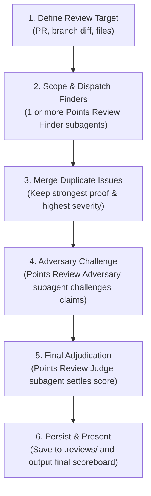

# Adversarial Code Review

Use this skill when you want a multi-stage review instead of a single-pass opinion. It is built for bug finding, adversarial challenge, and a final judged report with explicit scoring.

If a `CODEREVIEW.md` file exists in the repository root, read it before reviewing and treat it as additional steering for scope, priorities, and project-specific rules.

Use subagents heavily to separate the different stages of the review to ensure that the raw context from one stage does not leak into another and affects behavior.

## Review Angles

Cover these angles unless the user narrows the scope:

1. Correctness and business logic
2. Security and trust boundaries
3. Data integrity, state handling, and concurrency
4. Reliability, error handling, and observability
5. Performance and scalability
6. API, UX, regression risk, and test coverage gaps

## Scoring Rubric

Use the shared [scoring rubric](./references/scoring.md).

## Bundled Review Agents

This skill packages the review agents alongside the skill so the bundle is self-contained:

- [Points Review Finder](./agents/points-review-finder.agent.md)
- [Points Review Adversary](./agents/points-review-adversary.agent.md)
- [Points Review Judge](./agents/points-review-judge.agent.md)

## Workflow



1. Define the review target clearly: PR diff, branch diff, staged changes, files, folders, or a subsystem.
2. Read the root `CODEREVIEW.md` if it exists.
3. Decide the finder layout:
   - Use **one bundled [Points Review Finder](./agents/points-review-finder.agent.md)** subagent when the target is small or tightly related.
   - Use **multiple bundled [Points Review Finder](./agents/points-review-finder.agent.md)** subagents in parallel when the target is broad, naturally separable by area, or benefits from angle-based review.
4. Give each finder an explicit scope label such as `security`, `correctness`, `performance`, `complexity`, `malicious data exfiltration`, or `frontend-files`, and require it to return only issues with concrete proof.
5. Merge duplicate finder issues before adversary review. Keep the strongest proof and the highest still-defensible severity.
6. Run the bundled **[Points Review Adversary](./agents/points-review-adversary.agent.md)** subagent against the merged finder report. It must try to disprove, narrow, or downgrade every issue, and it may add new issues.
7. Run the bundled **[Points Review Judge](./agents/points-review-judge.agent.md)** subagent with the finder report, adversary report, and source context. The judge should re-check contested claims, settle severity, reject weak findings, and tally scores.
8. Persist review outputs under `.reviews/` in the current repository or working directory. Save raw finder, adversary, and judge outputs when practical; at minimum save the final judged report.
9. Present the judge's final report.

## Stage Contracts

| Stage | Required behavior | Output |
|---|---|---|
| Finder | Return only defensible issues with concrete proof. Focus on the assigned scope and angle. Verify exact target, changed contracts, reachable execution paths, and insufficient guards. | Each issue must include `Title`, `Severity`, `Points`, `Confidence`, `Changed Surface`, `Description`, `Execution Path`, `Broken Invariant`, and `Proof`. |
| Adversary | Challenge every finder issue, disprove weak claims, downgrade overstated severity, and add new issues only when they meet the same proof bar. | A challenge report with disproved, downgraded, confirmed, and new issues, plus a challenge score. |
| Judge | Re-check disputed claims in the source, keep the strongest defensible version of each issue, reject weak findings, and settle the final score. | A final scored report with a scoreboard, accepted issues, and rejected issues. |

`Proof` must show why an issue is real, not merely suspicious. It should cite concrete code locations and explain the triggering scenario, broken invariant, missing guard, or contradiction in behavior.

The adversary earns the full issue points for every disproved issue, the points for every new issue it finds, and the point difference for every issue it successfully downgrades.

Use this per-issue format in the final report:

```markdown
### <Title>
- Severity: <Minor|Moderate|Major|Critical>
- Points: <1|3|6|10>
- Confidence: <Low|Medium|High>
- Description: <short explanation>
- Proof: <code-based evidence and why it is a real issue>
```

## Output Contract

**Output schema: custom (per-finding entries + scoreboard, not the four-H3 report shape).**

Each accepted finding in the final Judge report uses the per-issue format defined under "Stage Contracts" above:

```markdown
### <Title>
- Severity: <Minor|Moderate|Major|Critical>
- Points: <1|3|6|10>
- Confidence: <Low|Medium|High>
- Description: <short explanation>
- Proof: <code-based evidence and why it is a real issue>
```

The Judge report opens with a scoreboard summarising:

- Total points across accepted issues
- Points by severity (Critical / Major / Moderate / Minor)
- Adversary score (disproved + downgraded + new-issue points)
- Issue count: accepted vs rejected

Persist raw Finder, Adversary, and Judge outputs under `.reviews/` when practical; at minimum persist the final judged report.

## Quality Bar

- **Proof or it didn't happen.** Every finding cites concrete code locations and explains the triggering scenario, broken invariant, or missing guard. "Looks risky" without execution-path evidence does not survive Judge.
- **Severity is defended, not declared.** Inflated severities get downgraded by the Adversary; the points awarded reflect the final severity after challenge.
- **No style / formatting / hypothetical findings.** Do not spend points on issues that aren't grounded in code behavior.
- **Confidence reflects evidence strength, not optimism.** Low = "I think this is real but my proof isn't airtight"; High = "the proof is in the diff and reproducible".
- **Empty result is a valid result.** If no issues survive Judge, say so plainly with the final scoreboard.
- Prefer fewer, better-supported findings over long speculative lists.
