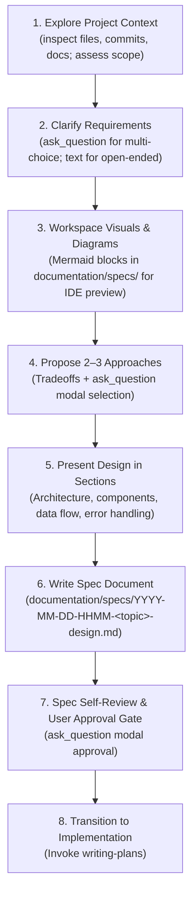

# Brainstorming

## Overview

Brainstorming turns ambiguous user intent into concrete, verified design specifications through disciplined interactive discovery.

**Core Philosophy:**
- **No code before spec**: Never start implementing without an approved design specification.
- **Interactive precision**: Use interactive modal dialogs (`ask_question`) for structured choices and decisions; use conversational chat for open-ended exploration.
- **Workspace visuals**: Use standard GitHub-flavored Markdown with Mermaid diagrams and clickable links (`file:///...`) so the developer can inspect architecture and flowcharts directly in their IDE.
- **One step at a time**: One question per message, 2–3 approaches with clear tradeoffs, and section-by-section design review.

Save validated design specs to:
`documentation/specs/YYYY-MM-DD-HHMM-<topic>-design.md`

---

## The Brainstorming Process

### Step 1: Explore Project Context & Assess Scope

1. **Inspect Context**: Check existing codebase files, documentation, dependencies, and recent git commits to understand conventions and architectural patterns.
2. **Scope Check**: If the user's request spans multiple independent subsystems or uncoupled features, stop and decompose immediately. Recommend splitting into distinct sub-projects before brainstorming individual features.
3. **Multi-Phase Tracking**: For complex brainstorming sessions involving multiple sub-decisions or design phases, create a temporary Task Artifact (`brainstorming_<topic>_tasks.md`) via `write_to_file` with `ArtifactMetadata` to visibly track answered questions, agreed architectural decisions, and remaining sections.

### Step 2: Clarifying Questions

1. **One Question at a Time**: Never overwhelm the user with multiple questions in a single response.
2. **Interactive Choices (`ask_question`)**:
   - On runtimes supporting interactive modal dialogs (such as Antigravity CLI `agy` and Antigravity IDE), use `ask_question` whenever presenting discrete options, constraints, technology choices, or scope boundaries.
   - List the recommended option first (prefixed with `(Recommended)`).
   - The interactive modal automatically provides a write-in option for custom feedback.
3. **Open-Ended Questions**: Use conversational markdown in chat when exploring broader problem contexts or subjective user intent.

### Step 3: Workspace Visuals & Diagrams

1. **Mermaid Diagrams**: When discussing architecture, component hierarchies, state machines, or sequence flows, generate standard Mermaid code blocks (`flowchart`, `sequenceDiagram`, `stateDiagram-v2`, `classDiagram`) directly in the spec or draft documentation.
2. **IDE Integration**: Always output clickable file links (`file:///absolute/path/to/file.md`) so the user can open and view rendered Markdown and Mermaid diagrams directly in their IDE previewer.
3. **UI Concepts**: For user interface design, describe layouts with structured wireframes or use `generate_image` to save visual mockups to `documentation/`.

### Step 4: Propose 2–3 Approaches

1. Propose 2–3 distinct architectural or design approaches.
2. For each approach, detail:
   - Core concept and mechanics.
   - Pros, cons, and trade-offs.
   - Architectural implications.
3. **Recommendation**: Clearly recommend one approach and explain why.
4. **Interactive Selection**: Present the approaches to the user via `ask_question`, listing the recommended option first.

### Step 5: Present Design in Sections

Present the chosen design in logical sections scaled to complexity:
- **Architecture & System Boundaries**
- **Components & Responsibilities**
- **Interfaces & Data Flow**
- **Error Handling & Edge Cases**
- **Testing & Verification Strategy**

Confirm alignment with the user after each major section before moving forward.

### Step 6: Write Design Spec

Save the complete validated design to:
`documentation/specs/YYYY-MM-DD-HHMM-<topic>-design.md`

Every spec must include:
- Header: Topic, Date, Status, and clickable links to any upstream requirements, issues, or PRs (`file:///...` or GitHub URLs).
- Context & Motivation: Problem statement and user goals.
- Non-Requirements & Constraints: What is explicitly out of scope, preventing scope creep and ambiguity.
- Architecture: Component responsibilities and system boundaries.
- Data Flow & Interfaces: Data structures, inputs, and outputs.
- Edge Cases & Error Handling.
- Testing Strategy: Acceptance criteria and test plan.

### Step 7: Spec Self-Review

Before asking for user approval, review the spec with a critical eye:
- **Placeholder Scan**: Eliminate any "TODO", "TBD", "fill in later", or vague requirements.
- **Contradiction Check**: Verify that earlier decisions align with later sections.
- **Scope Check**: Ensure the spec describes a single coherent feature or subsystem.
- **Clarity**: Ensure instructions and interfaces are specific enough for another engineer to implement without guessing.

*(Optional)* Dispatch a subagent reviewer using `spec-document-reviewer-prompt.md` via `invoke_subagent` for independent verification.

### Step 8: User Review Gate & Transition to Planning

1. **User Review Gate**: Present the final spec file path (`file:///...`) and prompt for user approval using `ask_question`:
   - `(Recommended) Approve spec and proceed to planning`
   - `Request changes to the spec`
2. **Transition**: Once approved, immediately invoke `skills-that-thrill:writing-plans` to generate the detailed implementation plan.
   - **Hard Rule**: The terminal state of brainstorming is `writing-plans`. Do not start writing implementation code or invoke other implementation skills.

---

## Anti-Patterns

| Anti-Pattern                                  | Why It Fails                                               | What to Do Instead                                     |
|:----------------------------------------------|:-----------------------------------------------------------|:-------------------------------------------------------|
| **"This task is simple, skip brainstorming"** | Simple tasks hide unexamined assumptions.                  | Run a quick, scaled-down brainstorm to align on scope. |
| **Multiple questions at once**                | Users answer only the easiest question or get overwhelmed. | Ask exactly one focused question per turn.             |
| **Plain text menus ("Type 1 for A...")**      | Creates friction and ambiguity.                            | Use `ask_question` for interactive selection.          |
| **Implementing before spec approval**         | Wastes time implementing unverified designs.               | Spec must be written, reviewed, and approved first.    |
| **External browser daemons**                  | Fragile background processes and open ports.               | Use workspace Markdown, Mermaid, and IDE previews.     |
