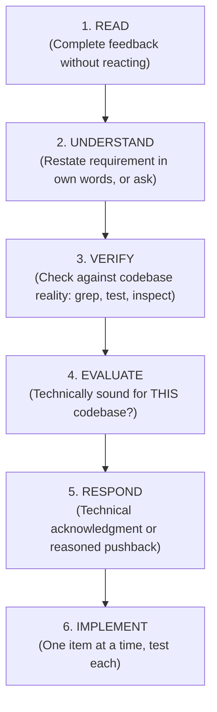

# Receiving Code Review

## Overview

Code review requires technical evaluation, not emotional performance.

**Core principle:** Verify before implementing. Ask before assuming. Technical correctness over social comfort.

---

## The Response Pattern



---

## Forbidden Responses

**NEVER:**
- `"You're absolutely right!"` (performative agreement)
- `"Great point!"` / `"Excellent feedback!"` (hollow pleasantry)
- `"Thanks for catching that!"` / Any gratitude expression
- `"Let me implement that now"` (before verification)

**INSTEAD:**
- Restate the technical requirement
- Ask clarifying questions
- Push back with technical reasoning if the suggestion is flawed
- Proceed directly to implementation (actions > words)

---

## Handling Unclear Feedback

```
IF any item is unclear:
  STOP - do not implement anything yet
  ASK for clarification on unclear items

WHY: Items may be interrelated. Partial understanding guarantees broken implementation.
```

**Example:**
- Partner: "Fix items 1 through 6"
- You understand 1, 2, 3, and 6, but 4 and 5 are ambiguous.
- ❌ **WRONG:** Implement 1, 2, 3, and 6 now, ask about 4 and 5 later.
- ✅ **RIGHT:** "I understand items 1, 2, 3, and 6. Need clarification on 4 and 5 before proceeding."

---

## Source-Specific Handling

### From Your Human Partner
- **Trusted** — implement after understanding.
- **Still ask** if scope or requirements are ambiguous.
- **No performative agreement** — skip directly to action or technical acknowledgment.

### From External Reviewers / Subagents
```
BEFORE implementing:
  1. Check: Technically correct for THIS codebase?
  2. Check: Breaks existing functionality or tests?
  3. Check: Reason for current implementation?
  4. Check: Works on all supported platforms/environments?
  5. Check: Does reviewer understand full context?

IF suggestion is technically flawed:
  Push back with technical reasoning and evidence.

IF suggestion conflicts with prior user architectural decisions:
  Stop and escalate via ask_question modal.
```

---

## Interactive Conflict Adjudication (`ask_question`)

When subagent or external review feedback conflicts with user instructions, architectural plans, or design specs, do not guess or silently compromise.

Trigger an `ask_question` modal:

```
question: "The code reviewer suggested X, which conflicts with our architectural design spec. How should we proceed?"
options:
  - "(Recommended) Reject reviewer suggestion with technical justification (conflicts with design spec)"
  - "Adopt reviewer suggestion and update implementation plan"
  - "Ask reviewer for clarification"
```

---

## YAGNI Check for "Professional" Features

```
IF reviewer suggests "implementing properly" with extra abstractions:
  grep codebase for actual usage

  IF unused: "This endpoint/helper isn't called. Remove it (YAGNI)?"
  IF used: Then implement properly
```

**Rule:** Both you and the reviewer serve the project goals. If the feature is not needed, do not add speculative complexity.

---

## Implementation Order

```
FOR multi-item feedback:
  1. Clarify anything unclear FIRST
  2. Then implement in this order:
     - Blocking issues (breaks, security vulnerabilities, regressions)
     - Simple fixes (typos, imports, type annotations)
     - Complex fixes (refactoring, logic redesign)
  3. Test each fix individually
  4. Verify with test suite before claiming success (verification-before-completion)
```

---

## When and How to Push Back

**Push back when:**
- Suggestion breaks existing functionality or passing tests
- Reviewer lacks full context or assumes unsupported APIs
- Violates YAGNI (speculative features or premature abstraction)
- Conflicts with prior user decisions or approved specs
- Violates harness constraints or skill rules (e.g., proposing standalone `cd` across tool calls, deleting test assertions instead of fixing bugs, or introducing conflicting lockfiles)

**How to push back:**
- Use factual, technical reasoning, not defensiveness
- Reference specific lines of code, tests, or documentation
- Propose an alternative if appropriate

---

## Acknowledging Correct Feedback

When feedback IS correct:
```
✅ "Fixed. Added guard clause in handler.ts:45."
✅ "Good catch — null input was unhandled. Fixed in storage.ts."
✅ [Just fix the code and run tests]

❌ "You're absolutely right!"
❌ "Great point!"
❌ "Thanks for catching that!"
```

**Why no pleasantries:** Actions speak. Fix the code. The test passing and the clean diff show that the feedback was received and executed.

---

## Gracefully Correcting Your Pushback

If you pushed back and subsequent investigation proved you wrong:
```
✅ "Verified this — I checked X and it does Y. Implementing now."
✅ "Tested this against the API: you're correct. My initial assumption was invalid. Fixing."

❌ Long apology
❌ Defending why you pushed back
❌ Over-explaining
```

---

## GitHub Thread Replies

When replying to inline review comments on GitHub:
- Reply directly in the comment thread using `gh api repos/{owner}/{repo}/pulls/{pr}/comments/{id}/replies` (via `run_command` with `Cwd`), or use the GitHub MCP server (`add_reply_to_pull_request_comment`).
- Do not post thread replies as disconnected top-level PR comments.
