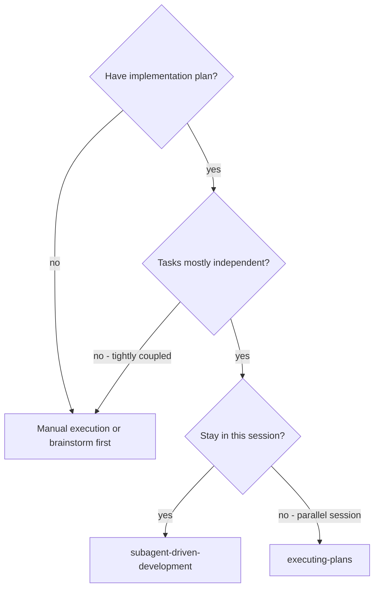

# Subagent-Driven Development

Execute plans by dispatching a fresh implementer subagent per task, conducting a task review (spec compliance + code quality) after each, and performing a broad whole-branch review at the end.

**Why subagents:** You delegate tasks to specialized agents with isolated context. By precisely crafting their instructions and context, you ensure they stay focused and succeed at their task. They should never inherit your session's entire history — you construct exactly what they need. This also preserves your own context for coordination work.

**Core principle:** Fresh subagent per task + task review (spec + quality) + broad final review = high quality, fast iteration.

**Reactive Wakeup (Zero Polling):** Antigravity CLI and IDE automatically resume your execution when a subagent completes or sends a message. After dispatching subagents or sending messages, simply stop calling tools to yield control. Never poll, loop, or run background sleep commands.

**Continuous execution:** Do not pause to ask routine "should I continue?" questions between tasks. Execute all tasks from the plan without stopping unless you hit a BLOCKED status you cannot resolve, a genuine plan conflict, or all tasks are complete.

---

## When to Use



**vs. Executing Plans (parallel session):**
- Same session (no context switch)
- Fresh subagent per task (no context pollution)
- Review after each task (spec compliance + code quality), broad review at the end
- Faster iteration (no human-in-loop between tasks)

---

## The Process

```mermaid
flowchart TD
    Setup["Setup: worktree, dual-layer ledger check, read plan, pre-flight review"]
    Setup --> DispatchImpl["Dispatch implementer subagent (./implementer-prompt.md)"]

    subgraph PerTask["Per Task"]
        DispatchImpl --> HasQuestions{"Implementer asks questions?"}
        HasQuestions -->|yes| AnswerQ["Answer questions via send_message"]
        AnswerQ --> ImplementWork["Implementer implements, tests, commits, self-reviews"]
        HasQuestions -->|no| ImplementWork
        ImplementWork --> DispatchReview["Generate review package, dispatch task reviewer (./task-reviewer-prompt.md)"]
        DispatchReview --> SpecApproved{"Spec verified and quality approved?"}
        SpecApproved -->|yes| CompleteTask["Append completion to ledger.md, update Task Artifact"]
        SpecApproved -->|no| PlanConflict{"Finding conflicts with plan text?"}
        PlanConflict -->|yes| AskHuman["Ask human partner via ask_question"]
        AskHuman --> FixRound["Fix round R of 5: R<=3 resume implementer; R>=4 fresh implementer, model: pro"]
        PlanConflict -->|no| FixRound
        FixRound --> ScopedReview["Dispatch scoped re-review (./re-review-prompt.md)"]
        ScopedReview --> AllAddressed{"All findings addressed?"}
        AllAddressed -->|yes| CompleteTask
        AllAddressed -->|no| MaxR{"R = 5?"}
        MaxR -->|"no - next round"| FixRound
        MaxR -->|"yes - breaker trips"| Adjudicate["Adjudicate each open finding"]
        Adjudicate --> LoadBearing{"Any load-bearing finding?"}
        LoadBearing -->|yes| Blocked["STOP: report BLOCKED to human partner"]
        LoadBearing -->|no| ParkFindings["Park findings in ledger with rulings"]
        ParkFindings --> CompleteTask
    end

    CompleteTask --> MoreTasks{"More tasks remain?"}
    MoreTasks -->|yes| DispatchImpl
    MoreTasks -->|no| FinalReview["Dispatch final code reviewer (../requesting-code-review/code-reviewer.md)"]
    FinalReview --> FinalFindings["Final findings? ONE fix dispatch, one scoped re-review, adjudicate residuals"]
    FinalFindings --> CleanWorkspace["Final review clean: delete this plan's workspace"]
    CleanWorkspace --> FinishBranch["Use skills-that-thrill:finishing-a-development-branch"]
```



---

## Setup

1. **Workspace Isolation:** Ensure work happens in an isolated workspace: use `skills-that-thrill:using-git-worktrees` to verify isolation. Sibling worktrees (`my-project/<branch>`) are standard.
2. **Dual-Layer Progress Tracking:**
   - **Task Artifact (User-Facing UI):** Create a Markdown checklist artifact in `<appDataDir>/brain/<conversation-id>/sdd_progress_<plan_slug>.md` using `write_to_file` with `ArtifactMetadata`. Update it with `replace_file_content` as tasks start and complete.
   - **Project-Local Markdown Ledger (`ledger.md`):** Run `scripts/sdd-workspace PLAN_FILE` — it ensures `.skills-that-thrill/sdd/<plan-slug>/` exists. Initialize or read `.skills-that-thrill/sdd/<plan-slug>/ledger.md`.
3. **Recovery Map:** The commits recorded in `ledger.md` and the Task Artifact survive context compaction. Trust them and `git log` over chat recollection.
4. **Pre-flight Plan Scan:** Read the plan from `documentation/plans/` and corresponding spec in `documentation/specs/`. Scan for contradictions. If any found, prompt your human partner via `ask_question` before execution begins.

---

## Model Selection

Select model tiers explicitly in Antigravity:

* **Mechanical implementation tasks** (isolated functions, clear specs, 1-2 files): `"flash"` or `"inherit"`.
* **Standard integration and judgment tasks** (multi-file coordination, tests): `"inherit"`.
* **Architecture and design tasks**: `"pro"` (or session `"inherit"`).
* **Final whole-branch review**: `"pro"` (or `"inherit"`).
* **Fix-loop escalation (rounds 4-5)**: `"pro"`.

---

## The Task Loop

Hand artifacts over as files. Never paste large diffs or histories through the controller's chat context.

### 1. Dispatch the Implementer

Record `BASE` (`git rev-parse HEAD`) before dispatching.

- **Task brief:** Run `scripts/task-brief PLAN_FILE N` to extract Task N's text to a brief file.
- **Report file:** Specify `.../task-N-report.md`.
- **Tool Call:** Call `invoke_subagent`:
  ```json
  {
    "Subagents": [
      {
        "TypeName": "self",
        "Role": "Task N Implementer",
        "Prompt": "Implement Task N per prompt template...",
        "Model": "inherit",
        "Workspace": "inherit"
      }
    ]
  }
  ```
- **Yield Control:** Stop calling tools after dispatch. The system will wake you up automatically when the subagent responds.

Template: [implementer-prompt.md](implementer-prompt.md)

### 2. Handle the Report

- **DONE:** Generate review package (`scripts/review-package PLAN_FILE BASE HEAD`), then dispatch task reviewer.
- **DONE_WITH_CONCERNS:** Inspect concerns before review; if non-blocking observations, proceed to review.
- **NEEDS_CONTEXT:** Provide missing context via `send_message(Recipient: conversationId, ...)` or re-dispatch.
- **BLOCKED:** Assess blocker. Provide context, escalate model to `"pro"`, or prompt human partner.

If the implementer asks questions before starting or mid-task, answer via `send_message(Recipient: conversationId, Message: ...)`.

### 3. Review the Task

- Run `scripts/review-package PLAN_FILE BASE HEAD` and pass the resulting diff file to the reviewer.
- Dispatch reviewer via `invoke_subagent`:
  ```json
  {
    "Subagents": [
      {
        "TypeName": "research",
        "Role": "Task N Reviewer",
        "Prompt": "Review Task N per prompt template...",
        "Model": "inherit",
        "Workspace": "inherit"
      }
    ]
  }
  ```
- Yield control and wait for reactive notification.

Template: [task-reviewer-prompt.md](task-reviewer-prompt.md)

### 4. The Fix Loop

Triggers when review reports spec ❌ or any Critical/Important finding.

- **Plan Conflicts:** If a finding conflicts with the plan text, prompt the human partner using `ask_question`:
  ```
  question: "Task N review finding conflicts with plan text. Which governs?"
  options:
    - "Plan governs: override finding and proceed"
    - "Reviewer governs: require implementer to fix finding"
  ```
- **Rounds 1-3:** Send findings to the implementer via `send_message` (or dispatch fresh implementer with brief + report).
- **Rounds 4-5:** Dispatch fresh implementer on `Model: "pro"`.
- **Scoped Re-Review:** Run `scripts/review-package PLAN_FILE FIX_BASE HEAD` and dispatch `re-review-prompt.md`.
- **The Breaker (Cap at 5):** If round 5 leaves findings open, prompt the human partner via `ask_question` to adjudicate or halt.

Template: [re-review-prompt.md](re-review-prompt.md)

### 5. Complete the Task

When review is approved (or open findings adjudicated at the cap):
1. Append completion entry to `.skills-that-thrill/sdd/<plan-slug>/ledger.md`:
   ```markdown
   | Task N | COMPLETE | <commit-sha> | Approved |
   ```
2. Update user-facing Task Artifact (`sdd_progress_<slug>.md`) using `replace_file_content` (`- [ ]` -> `- [x]`).
3. Move directly to the next task without asking unnecessary conversational questions.

---

## Final Review & Completion

1. **Whole-Branch Review:** Run `scripts/review-package PLAN_FILE MERGE_BASE HEAD`. Dispatch final reviewer on `Model: "pro"` using `skills-that-thrill:requesting-code-review`. *(For high-stakes, security-sensitive, or complex branch features, consider invoking `skills-that-thrill:adversarial-code-review` and `skills-that-thrill:reviewing-security`).*
2. **Fix Wave:** If final findings emerge, dispatch ONE fix subagent for the complete list, followed by one scoped re-review.
3. **Cleanup:** Delete the temporary `.skills-that-thrill/sdd/<plan-slug>/` scratch directory.
4. **Handoff:** Use `skills-that-thrill:finishing-a-development-branch` to integrate the work.

---

## Quick Reference

| Action                       | Antigravity Tool / Mechanism                                          |
|:-----------------------------|:----------------------------------------------------------------------|
| **Dispatch implementer**     | `invoke_subagent` (`TypeName: "self"`)                                |
| **Dispatch reviewer**        | `invoke_subagent` (`TypeName: "research"`)                            |
| **Subagent communication**   | `send_message(Recipient: conversationId, Message: ...)`               |
| **Waiting for subagent**     | Stop calling tools (reactive wakeup; zero polling)                    |
| **User-facing progress**     | Conversation Task Artifact (`write_to_file` / `replace_file_content`) |
| **Workspace progress**       | `.skills-that-thrill/sdd/<plan-slug>/ledger.md`                       |
| **Plan conflicts & Breaker** | Interactive modal via `ask_question`                                  |
| **Plan & Spec paths**        | `documentation/plans/` and `documentation/specs/`                     |
