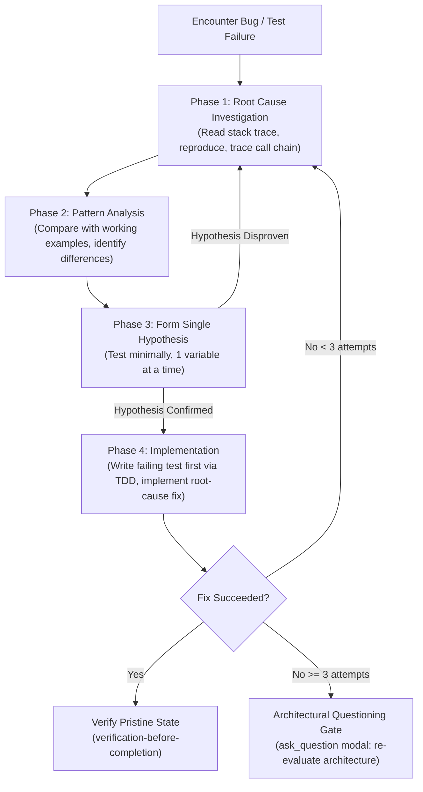

# Systematic Debugging

## Overview

**Core principle:** ALWAYS find root cause before attempting fixes. Symptom fixes are failure.

**Violating the letter of this process is violating the spirit of debugging.**

---

## The Iron Law

```
NO FIXES WITHOUT ROOT CAUSE INVESTIGATION FIRST
```

If you haven't completed Phase 1, you cannot propose fixes. Period.

---

## When to Use

Use for ANY technical issue:
- Test failures
- Bugs in production / runtime
- Unexpected behavior
- Performance degradation
- Build or compile failures
- Integration issues

**Use this ESPECIALLY when:**
- Under time pressure (emergencies make guessing tempting)
- "Just one quick fix" seems obvious
- You've already tried multiple fixes
- Previous fix didn't work
- You don't fully understand the issue

**Don't skip when:**
- Issue seems simple (simple bugs have root causes too)
- You're in a hurry (rushing guarantees rework)
- Stakeholder wants it fixed NOW (systematic is faster than thrashing)

---

## The Four Phases

You MUST complete each phase before proceeding to the next.



---

### Phase 1: Root Cause Investigation

**BEFORE attempting ANY fix:**

1. **Read Error Messages Carefully**
   - Don't skip past errors or warnings, they often contain the exact solution
   - Read stack traces completely
   - Note line numbers, file paths, error codes

2. **Reproduce Consistently**
   - Can you trigger it reliably?
   - What are the exact steps or input payload?
   - Does it happen every time?
   - If not reproducible → gather more data, do not guess

   > [!IMPORTANT]
   > **Antigravity Command Execution Safety:**
   > Never propose a standalone `cd` command across tool calls. Execute reproduction commands and diagnostic scripts with the `Cwd: "$WORKTREE_PATH"` parameter in `run_command`, or execute within subshells `(cd "$WORKTREE_PATH" && <command>)`.

3. **Check Recent Changes**
   - What changed that could cause this?
   - Inspect git diff and recent commits
   - Check new dependencies, config updates, environment variables

4. **Gather Evidence in Multi-Component Systems**
   When system has multiple components (API → service → DB, CI → build → signing):
   - Add diagnostic instrumentation at each boundary
   - Log input and output data at each boundary
   - Run once to gather evidence showing WHERE it breaks
   - Analyze evidence to isolate the failing component

5. **Trace Data Flow Backward**
   When error is deep in call stack:
   - Consult [root-cause-tracing.md](root-cause-tracing.md)
   - Where does the invalid value originate?
   - What called this method with that invalid value?
   - Keep tracing up the call stack until you find the source
   - Fix at source, not at symptom

6. **Irreproducibility Gate (`ask_question`)**
   If an issue cannot be reproduced after thorough logging and environment auditing:
   - Do NOT guess or patch symptoms.
   - Use `ask_question` to request specific environment details or sample payloads from your human partner.

---

### Phase 2: Pattern Analysis

**Find the pattern before fixing:**

1. **Find Working Examples**
   - Locate similar working code in same codebase
   - What works that is similar to what is broken?

2. **Compare Against References**
   - If implementing a pattern or protocol, read reference implementation completely
   - Don't skim — read every line and understand assumptions

3. **Identify Differences**
   - What is different between working and broken?
   - List every difference, however small
   - Don't assume "that can't matter"

4. **Understand Dependencies**
   - What settings, config, or environment does this depend on?

---

### Phase 3: Hypothesis and Testing

**Scientific method:**

1. **Form Single Hypothesis**
   - State clearly: "I think X is the root cause because Y"
   - Be specific, not vague

2. **Test Minimally**
   - Make the SMALLEST possible change to test the hypothesis
   - One variable at a time
   - Don't fix multiple things at once

3. **Verify Before Continuing**
   - Did it confirm hypothesis? Yes → Phase 4
   - Didn't confirm? Revert test change and form a NEW hypothesis
   - DO NOT pile more speculative changes on top

4. **When You Don't Know**
   - State clearly what is not understood
   - Do not pretend to know or gamble on code changes
   - Research or ask for guidance

---

### Phase 4: Implementation

**Fix the root cause, not the symptom:**

1. **Create Failing Test Case**
   - Write the simplest possible reproduction test
   - Follow `skills-that-thrill:test-driven-development` (RED test watched failing)
   - Automated test if possible; minimal reproduction script if no test framework exists

2. **Implement Single Fix**
   - Address the root cause identified
   - ONE change at a time
   - No "while I'm here" refactoring or speculative improvements

3. **Verify Fix**
   - Test passes cleanly?
   - No other tests broken?
   - Issue genuinely resolved?
   - Use `skills-that-thrill:verification-before-completion` before claiming success
   - **Capture Learnings:** If the root cause was non-obvious, surprising, or incurred high investigation friction, invoke `skills-that-thrill:capturing-learnings` (or suggest the `/learn` slash command in chat) to record the gotcha and solution pattern into project memory.

4. **If Fix Doesn't Work**
   - STOP
   - Count: How many fixes have you tried?
   - If < 3: Return to Phase 1, re-analyze with new information
   - **If ≥ 3: STOP and trigger the Architectural Questioning Gate**

5. **Architectural Questioning Gate (3+ Fixes Failed)**

   **Pattern indicating architectural problem:**
   - Each fix reveals new shared state, unexpected coupling, or breaks another test
   - Fixes require massive refactoring to implement
   - Each fix creates new symptoms elsewhere

   > [!CAUTION]
   > **STOP: Do NOT attempt fix #4.** 3+ failed fixes indicates wrong architecture, not a bad hypothesis.

   Prompt your human partner via `ask_question`:
   ```
   question: "3 fix attempts have failed, indicating an underlying architectural or pattern flaw. How should we proceed?"
   options:
     - "(Recommended) Question architecture: re-evaluate coupling, state, or pattern fundamentals"
     - "Gather additional boundary traces / diagnostic logs"
     - "Discuss alternative design approach with user"
   ```

---

## Anti-Patterns & Red Flags

If you catch yourself thinking:
- "Quick fix for now, investigate later"
- "Just try changing X and see if it works"
- "Add multiple changes, run tests"
- "Skip the test, I'll manually verify"
- "It's probably X, let me fix that"
- "I don't fully understand but this might work"
- "Running background sleep to wait for async process"
- "One more fix attempt" (when already tried 2+)
- Each fix reveals new problem in different place

**ALL of these mean: STOP. Return to Phase 1.**

---

## Warning Signals You're Doing It Wrong

**Watch for these signs:**
- You assumed a behavior without verifying with a diagnostic log or test
- You proposed fixes without inspecting data at component boundaries
- You're guessing instead of tracing call chains
- You're thrashing across multiple files

**When you see these:** STOP. Return to Phase 1.

---

## Common Rationalizations

| Excuse                                       | Reality                                                                 |
|:---------------------------------------------|:------------------------------------------------------------------------|
| "Issue is simple, don't need process"        | Simple issues have root causes too. Process is fast for simple bugs.    |
| "Emergency, no time for process"             | Systematic debugging is FASTER than guess-and-check thrashing.          |
| "Just try this first, then investigate"      | First fix sets the pattern. Do it right from the start.                 |
| "I'll write test after confirming fix works" | Untested fixes don't stick. Test first proves it.                       |
| "Multiple fixes at once saves time"          | Can't isolate what worked. Causes new bugs.                             |
| "Reference too long, I'll adapt the pattern" | Partial understanding guarantees bugs. Read it completely.              |
| "I see the problem, let me fix it"           | Seeing symptoms ≠ understanding root cause.                             |
| "One more fix attempt" (after 2+ failures)   | 3+ failures = architectural problem. Question pattern, don't fix again. |

---

## Quick Reference

| Phase                 | Key Activities                                                           | Success Criteria                  |
|:----------------------|:-------------------------------------------------------------------------|:----------------------------------|
| **1. Root Cause**     | Read errors, reproduce, check changes, gather evidence, trace call chain | Understand WHAT broke and WHY     |
| **2. Pattern**        | Find working examples, compare against references                        | Identify concrete differences     |
| **3. Hypothesis**     | Form theory, test minimally (one variable)                               | Confirmed or disproven hypothesis |
| **4. Implementation** | Create failing test (TDD), fix root cause, verify                        | Bug resolved, zero regressions    |

---

## Supporting Guides

These techniques are part of systematic debugging and available in this directory:

- [root-cause-tracing.md](root-cause-tracing.md) - Trace bugs backward through call stack to find original trigger
- [defense-in-depth.md](defense-in-depth.md) - Add validation at multiple layers after finding root cause
- [condition-based-waiting.md](condition-based-waiting.md) - Replace arbitrary timeouts and sleep with condition polling
