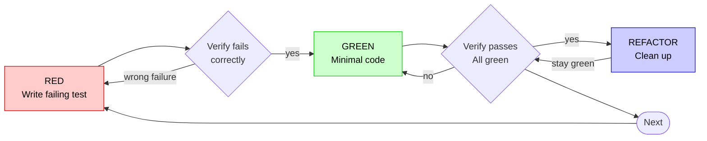

# Test-Driven Development (TDD)

## Overview

Write the test first. Watch it fail. Write minimal code to pass.

**Core principle:** If you didn't watch the test fail, you don't know if it tests the right thing.

**Violating the letter of the rules is violating the spirit of the rules.**

---

## When to Use

**Always:**
- New features
- Bug fixes
- Refactoring
- Behavior changes

**Exceptions (ask your human partner):**
- Throwaway prototypes
- Generated code
- Configuration files

Thinking "skip TDD just this once"? Stop. That's rationalization.

---

## The Iron Law

```
NO PRODUCTION CODE WITHOUT A FAILING TEST FIRST
```

Write code before the test? Delete it. Start over.

**No exceptions:**
- Don't keep it as "reference"
- Don't "adapt" it while writing tests
- Don't look at it
- Delete means delete

Implement fresh from tests. Period.

---

## Red-Green-Refactor



### 1. RED - Write Failing Test

Write one minimal test showing what should happen.

```typescript
// Good: Clear name, tests real behavior, one thing
test('retries failed operations 3 times', async () => {
  let attempts = 0;
  const operation = () => {
    attempts++;
    if (attempts < 3) throw new Error('fail');
    return 'success';
  };

  const result = await retryOperation(operation);

  expect(result).toBe('success');
  expect(attempts).toBe(3);
});
```

**Requirements:**
- One behavior
- Clear name
- Real code (no mocks unless unavoidable)

---

### 2. Verify RED - Watch It Fail

**MANDATORY. Never skip.**

> [!IMPORTANT]
> **Antigravity Command Execution Safety:**
> Never propose a standalone `cd` command across tool calls. Execute test commands using `run_command` with the `Cwd: "$WORKTREE_PATH"` parameter, or execute in subshells `(cd "$WORKTREE_PATH" && <command>)`.

Execute the focused test command:
- **TypeScript / JavaScript:** `npm test -- path/to/test.test.ts` or `npx vitest run path/to/test.test.ts`
- **Python:** `pytest path/to/test_feature.py`
- **Rust:** `cargo test test_feature_name`
- **Go:** `go test -v ./path/to/package -run TestFeature`
- **Bash / Shell:** `bats path/to/test.bats`

**Confirm:**
- Test fails (not compilation/syntax error)
- Failure message is expected
- Fails because feature missing (not typos)

**Capture RED Evidence:**
Record the exact command run (with `Cwd`) and the failing output proving the behavior was absent.

**Test passes?** You're testing existing behavior. Fix test.  
**Test crashes or environment errors?** Distinguish between an expected missing symbol (e.g. `ReferenceError: function is not defined`) and harness/environmental crashes (e.g. broken test runner config, invalid imports, test setup syntax error). For harness or configuration issues, invoke `skills-that-thrill:systematic-debugging` to trace and fix the test fixture first. Re-run until the test fails cleanly for the missing feature.

---

### 3. GREEN - Minimal Code

Write the simplest code to pass the test.

```typescript
// Good: Just enough to pass
async function retryOperation<T>(fn: () => Promise<T>): Promise<T> {
  for (let i = 0; i < 3; i++) {
    try {
      return await fn();
    } catch (e) {
      if (i === 2) throw e;
    }
  }
  throw new Error('unreachable');
}
```

Don't add unrequested features, premature abstractions, or "improve" beyond the test.

---

### 4. Verify GREEN - Watch It Pass

**MANDATORY.**

Run the test command with `Cwd: "$WORKTREE_PATH"`.

**Confirm:**
- Test passes
- Other tests still pass
- Output pristine (no errors or unexpected warnings)

**Capture GREEN Evidence:**
Record the exact command run and the passing output summary.

**Test fails?** Fix implementation, not test.  
**Other tests fail?** Fix regression immediately.

---

### 5. REFACTOR - Clean Up

After green only:
- Remove duplication
- Improve names
- Extract helpers

Keep tests green. Do not alter behavior.

---

### Repeat

Move to the next failing test for the next increment.

---

## Good Tests

| Quality          | Good                                | Bad                                                 |
|:-----------------|:------------------------------------|:----------------------------------------------------|
| **Minimal**      | One thing. "and" in name? Split it. | `test('validates email and domain and whitespace')` |
| **Clear**        | Name describes behavior             | `test('test1')`                                     |
| **Shows intent** | Demonstrates desired API            | Obscures what code should do                        |

When writing or changing any test, read [writing-good-tests.md](writing-good-tests.md) for the rules that keep tests honest:
- Name the production change that would make the test fail — before writing it
- Assert on real behavior, never on mock behavior
- Keep test-only code in test utilities, out of production classes
- Understand a dependency's side effects before mocking it

---

## Interactive Dilemma Resolution (`ask_question`)

When an agent hits a testing roadblock or architectural dilemma:
- Testing legacy code that lacks existing test harness
- External network/service boundaries where mock vs integration is unclear
- Fundamental API uncertainty

**Do not guess or skip TDD.** Use `ask_question` to resolve with your human partner:
```
question: "Encountered a testing dilemma in [component]. How should we proceed?"
options:
  - "(Recommended) Approach A: [Specific test strategy]"
  - "Approach B: [Alternative strategy]"
```

---

## Common Rationalizations

| Excuse                                 | Reality                                                                                                                                    |
|:---------------------------------------|:-------------------------------------------------------------------------------------------------------------------------------------------|
| "Too simple to test"                   | Simple code breaks. Test takes 30 seconds.                                                                                                 |
| "I'll test after"                      | Tests written after pass immediately — which proves nothing. You never watched it fail, so you never proved it can catch bugs.             |
| "Tests after achieve same goals"       | Tests-after answer "what does this do?"; tests-first answer "what should this do?" Tests written after are biased by code already written. |
| "Already manually tested"              | Manual testing is ad-hoc, untracked, and unreproducible. Automated tests run identically every time.                                       |
| "Deleting X hours is wasteful"         | Sunk cost fallacy. Rewriting with TDD gives high confidence. Keeping untrusted code is the real waste.                                     |
| "Keep as reference, write tests first" | You'll adapt it. That's testing after. Delete means delete.                                                                                |
| "Need to explore first"                | Fine. Throw away exploration, start fresh with TDD.                                                                                        |
| "Test hard = design unclear"           | Listen to the test. Hard to test = hard to use.                                                                                            |
| "TDD will slow me down"                | TDD is the pragmatic path: catches bugs before commit, prevents regressions, lets you refactor without fear.                               |
| "Existing code has no tests"           | You're improving it. Add tests for the slice you touch.                                                                                    |

---

## Red Flags - STOP and Start Over

- Code written before test
- Test added after implementation
- Test passes on first run
- Cannot explain why test failed
- "Keep as reference" or "adapt existing code"
- "TDD is dogmatic, I'm being pragmatic"

**All of these mean: Delete code. Start over with TDD.**

---

## Verification Checklist

Before marking work complete:
- [ ] Every new function/method has a test
- [ ] Watched each test fail before implementing
- [ ] Each test failed for expected reason (feature missing, not typo)
- [ ] Wrote minimal code to pass each test
- [ ] All tests pass
- [ ] Output pristine (no errors, warnings)
- [ ] Tests use real code (mocks only if unavoidable)
- [ ] Edge cases and errors covered

Can't check all boxes? You skipped TDD. Start over.

---

## Final Rule

```
Production code → test exists and failed first
Otherwise → not TDD
```

No exceptions without your human partner's explicit permission.
