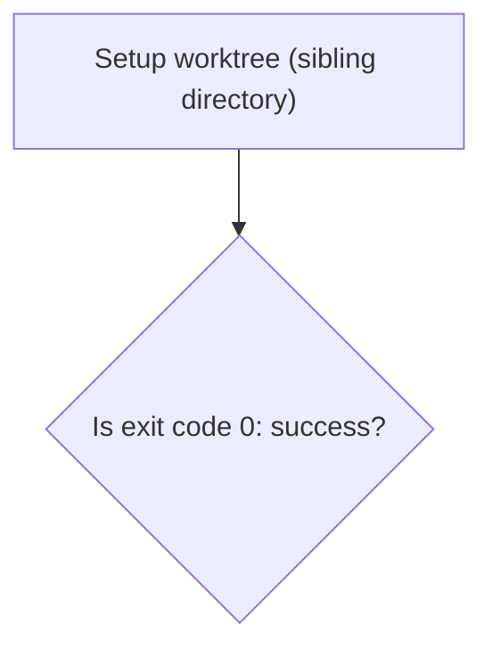
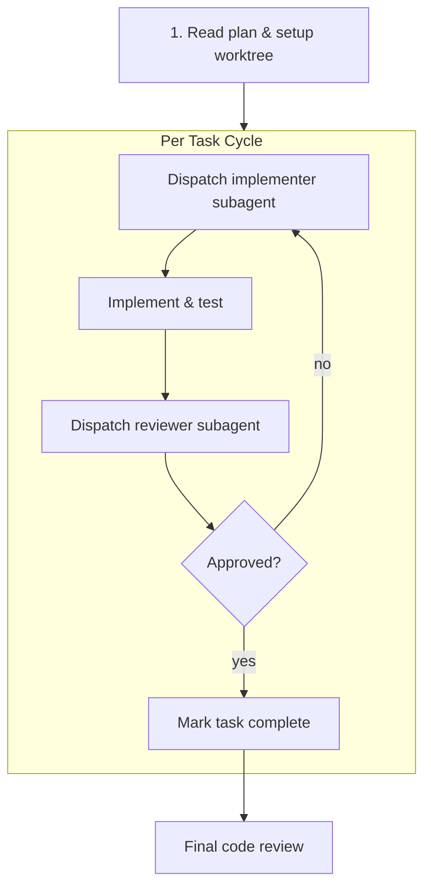
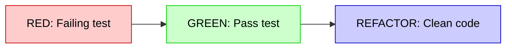

# Mermaid Style Conventions for Skills

**Load this reference when:** creating or editing visual diagrams in skills, design specs, or implementation plans.

---

## Overview

In Antigravity and modern markdown workflows, **Mermaid** is the standard for visual diagrams. It renders natively inside IDEs (VS Code, JetBrains, Cursor) and on GitHub without requiring Graphviz binaries, Node.js scripts, or background daemons.

Use Mermaid diagrams to make decision trees, lifecycle loops, and subagent coordination immediately comprehensible.

---

## 1. Supported Diagram Types

| Type                     | Fenced Syntax                         | Best Used For                                      |
|:-------------------------|:--------------------------------------|:---------------------------------------------------|
| **Flowchart**            | ````mermaid\nflowchart TD\n...````    | Decision trees, procedural gates, execution loops  |
| **Horizontal Flowchart** | ````mermaid\nflowchart LR\n...````    | Linear pipelines, TDD Red-Green cycles             |
| **Sequence Diagram**     | ````mermaid\nsequenceDiagram\n...```` | Parent coordinator ↔ subagent message interactions |
| **State Diagram**        | ````mermaid\nstateDiagram-v2\n...```` | Agent lifecycle states and task transitions        |

---

## 2. Node Types & Semantic Shapes

In flowcharts, assign semantic meaning to node shapes:

| Semantic Meaning                 | Mermaid Syntax                    | Example                           |
|:---------------------------------|:----------------------------------|:----------------------------------|
| **Action / Step**                | `id["Action text"]` (rectangle)   | `A["Write minimal failing test"]` |
| **Decision / Question**          | `id{"Question?"}` (rhombus)       | `Q{"Does test fail correctly?"}`  |
| **Start / Finish / Milestone**   | `id(["Label"])` (stadium)         | `S(["Feature branch created"])`   |
| **Subagent / Sub-Process**       | `id[["Subroutine"]]` (subroutine) | `Sub[["Dispatch task reviewer"]]` |
| **Critical Warning / Stop Gate** | `id{{"WARNING"}}` (hexagon)       | `W{{"STOP: Untested changes"}}`   |

---

## 3. Quoting Rule (Syntax Safety)

> [!IMPORTANT]
> **Always Quote Node Labels Containing Special Characters:**
> Special characters such as parentheses `()`, brackets `[]`, braces `{}`, colons `:`, and quotes break Mermaid's parser if not wrapped in double quotes.



---

## 4. Edge Labels & Transitions

| Transition Type        | Syntax     | Usage                                |
|:-----------------------|:-----------|:-------------------------------------|
| Direct flow            | `A --> B`  | Sequential progression               |
| Labeled branch         | `A -->     | yes                                  | B` | Decision outcomes ("yes", "no") |
| Quoted branch label    | `A -->     | "no - next round"                    | B` | Labels with spaces or punctuation |
| Asynchronous / trigger | `A -.-> B` | Event notification, reactive wakeups |

---

## 5. Subgraphs for Phase Grouping

Use `subgraph` to visually isolate loops, per-task subagent lifecycles, or logical domains:



---

## 6. Styling & Highlighting

Apply standard styling at the bottom of the diagram using hex color codes:



Recommended semantic palette:
- **Red (Failure / Alert):** `fill:#ffcccc,stroke:#cc0000,color:#000000`
- **Green (Success / Passing):** `fill:#ccffcc,stroke:#00cc00,color:#000000`
- **Blue (Action / Info):** `fill:#d0e1fd,stroke:#1a73e8,color:#000000`
- **Yellow (Warning / Pause):** `fill:#fff3cd,stroke:#ffeeba,color:#856404`

---

## 7. Zero Daemon Overhead

Never invoke external browser-based preview daemons or generate standalone SVG files via background Node.js processes. 
Mermaid code blocks embedded in Markdown files (`documentation/specs/*.md`, `documentation/plans/*.md`, `SKILL.md`) are automatically rendered by the user's IDE or GitHub web interface.
