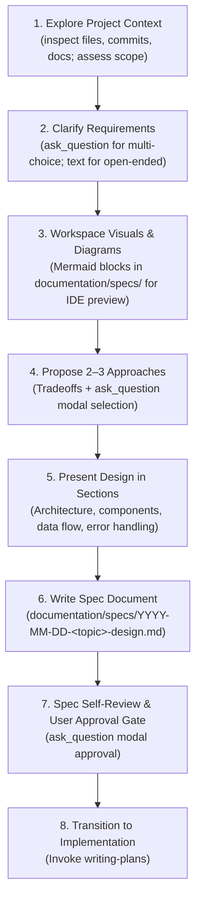

# Design Specification: Antigravity-First Native Brainstorming Skill

**Date:** 2026-09-28  
**Topic:** Brainstorming Skill Adaptation for Antigravity CLI & Multi-Harness  
**Status:** Approved by User  

---

## 1. Context & Motivation

The `brainstorming` skill in `skills-that-thrill` was originally ported from the `superpowers` plugin designed around Claude Code's terminal CLI environment. Because raw terminals cannot render visual diagrams, images, or interactive selection dialogs, the original skill relied on:
1. Asking plain-text numbered lists in the terminal ("Type 1 for A, 2 for B").
2. A heavy, external Node.js daemon (`server.cjs`, `start-server.sh`, `stop-server.sh`, `frame-template.html`, `helper.js`) that opened a separate browser tab over WebSockets to show HTML fragments and read user click events from an `events` file.

In **Antigravity CLI (`agy`)**, developers frequently run the CLI inside a terminal emulator alongside or inside their favorite IDE (JetBrains, VS Code, etc.). Antigravity CLI natively provides:
* **Interactive TUI Modal Dialogs (`ask_question`)**: A keyboard-driven terminal selector (arrow keys, space to select, enter to submit) for choices, options, and reviews directly in the CLI.
* **Workspace Documentation**: Specs and diagrams stored in `documentation/specs/` are immediately visible, editable, and previewable (with native Mermaid rendering) inside the developer's IDE.

This design adapts `brainstorming` to be **Antigravity-First** (leveraging `ask_question` and workspace documentation) while remaining lean, zero-dependency, and cross-harness compatible.

---

## 2. Key Architecture Decisions

### 2.1 Complete Removal of External Browser Companion
* **Action:** Delete `skills/brainstorming/visual-companion.md` and the entire `skills/brainstorming/scripts/` directory (`server.cjs`, `start-server.sh`, `stop-server.sh`, `frame-template.html`, `helper.js`).
* **Rationale:** Eliminates ~45 KB of fragile background daemons, port allocations, and external dependencies. The developer's IDE renders Markdown and Mermaid diagrams natively, and `ask_question` handles interactive selections in the terminal.

### 2.2 Native Visuals in Workspace Documentation
* **Action:**
  * For **Architecture, Data Flow, Sequence, & State Diagrams**: Generate standard GitHub-flavored Markdown containing Mermaid fenced code blocks (`flowchart`, `sequenceDiagram`, `stateDiagram-v2`, `classDiagram`) directly in the spec or draft documentation.
  * For **UI Concepts**: Describe UI layout/components with clear wireframes, or use `generate_image` to place visual assets in `documentation/` for IDE preview.
  * **File Links**: Always output clickable file links (`file:///...`) so the developer can click to open and preview them instantly in their IDE.

### 2.3 Interactive Terminal Modals for Decisions (`ask_question`)
* **Action:**
  * For **Clarifying Questions**: Use `ask_question` whenever presenting discrete options, constraints, or configurations. Use conversational markdown text for open-ended queries.
  * For **Approach Selection**: Detail 2–3 approaches with tradeoffs and recommendations in the terminal, accompanied by an `ask_question` modal with the recommended option listed first.
  * For **User Review Gate**: Present the final spec approval via `ask_question`.

### 2.4 Spec Storage & Formatting
* **Action:** Canonical spec location is `documentation/specs/YYYY-MM-DD-<topic>-design.md` (avoiding abbreviations like `docs`).
* All specs are stored directly in the workspace repository so they appear in the IDE file tree and can be tracked by Git.

---

## 3. Workflow Specification

### Phase Details:

1. **Explore Project Context**:
   * Inspect existing codebase files, documentation, and git history.
   * If the scope spans multiple independent subsystems, flag and decompose into sub-projects before detailed design.

2. **Clarifying Questions**:
   * Ask one question at a time.
   * Use `ask_question` for multiple-choice / scoped choices.
   * Use conversational text for open-ended exploration.

3. **Workspace Visuals**:
   * Write architecture, sequence, and component diagrams using Mermaid code blocks inside Markdown documents.
   * Provide clickable file links (`file:///...`) so the user can view the rendered diagram in their IDE.

4. **Proposing Approaches**:
   * Present 2–3 distinct approaches with tradeoffs and clear recommendations.
   * Prompt user selection via `ask_question`.

5. **Presenting Design in Sections**:
   * Break the design into manageable sections (Architecture, Components, Interfaces/Data Flow, Error Handling, Testing).
   * Confirm alignment on each section before proceeding.

6. **Writing the Spec**:
   * Save the validated spec to `documentation/specs/YYYY-MM-DD-<topic>-design.md`.

7. **Spec Self-Review & User Approval**:
   * Self-review checklist: placeholders, contradictions, scope creep, ambiguity.
   * Prompt user approval using `ask_question`.

8. **Transition**:
   * Transition directly to `writing-plans`.

---

## 4. Components Modified & Deleted

| File | Action | Description |
| :--- | :--- | :--- |
| `skills/brainstorming/SKILL.md` | Rewrite | Update workflow to reflect `ask_question` TUI modals, workspace Mermaid diagrams, and clean `documentation/specs/` paths; remove visual companion references. |
| `skills/brainstorming/spec-document-reviewer-prompt.md` | Update | Update path references to `documentation/specs/` and specify subagent invocation pattern. |
| `skills/brainstorming/visual-companion.md` | Delete | No longer needed; replaced by IDE workspace viewing. |
| `skills/brainstorming/scripts/*` | Delete | Delete `server.cjs`, `start-server.sh`, `stop-server.sh`, `frame-template.html`, `helper.js`. |
| `skills/using-skills-that-thrill/references/antigravity-tools.md` | Update | Ensure brainstorming tool mapping highlights `ask_question` and workspace documentation links. |

---

## 5. Verification & Acceptance Criteria

1. **Clean Skill Definitions**: `SKILL.md` contains no dangling links to deleted files or scripts.
2. **Path Integrity**: All spec paths point consistently to `documentation/specs/`.
3. **Interactive Guidance**: Explicit instructions for `ask_question` on Antigravity/capable runtimes.
4. **Zero-Dependency**: No Node server scripts or daemon requirements remain in `skills/brainstorming/`.
