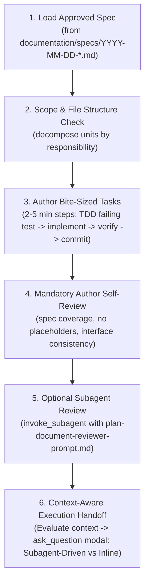

# Design Specification: Antigravity-First Writing Plans Skill

**Date:** 2026-09-28  
**Topic:** Writing Plans Skill Adaptation for Antigravity & Multi-Harness  
**Status:** Approved by User  

---

## 1. Context & Motivation

The `writing-plans` skill produces bite-sized, test-driven implementation plans from approved specifications. It bridges design and execution.

In the original implementation:
- Paths used `documentation/skills-that-thrill/plans/` or `docs/superpowers/plans/`.
- The execution handoff hard-coded `Subagent-Driven (recommended)` for every situation, regardless of task characteristics.
- Subagent dispatch instructions lacked Antigravity's native `invoke_subagent` syntax and reactive wakeup guidelines.

This adaptation modernizes `writing-plans` for **Antigravity-First** usage, aligns file paths with `documentation/specs/`, and makes the execution handoff context-aware and neutral by default.

---

## 2. Key Architecture Decisions

### 2.1 Path Standardization
* **Plans:** Store in `documentation/plans/YYYY-MM-DD-<feature-name>.md` (standardizing on `documentation/`, eliminating abbreviations like `docs/`).
* **Specs:** Reference designs in `documentation/specs/YYYY-MM-DD-<topic>-design.md`.

### 2.2 Context-Aware Execution Handoff (`ask_question`)
* The handoff between **Subagent-Driven** and **Inline Execution** must NOT hardcode `(Recommended)` onto Subagent-Driven.
* **Selection Criteria:**
  * **Recommend Subagent-Driven (`skills-that-thrill:subagent-driven-development`)** when: Tasks are highly modular, independent, can be executed in parallel, or require fresh isolated contexts to prevent token pollution.
  * **Recommend Inline Execution (`skills-that-thrill:executing-plans`)** when: Tasks are tightly coupled, sequential, small scripts/configs, or require continuous shared session state.
  * **Neutral Presentation:** If neither approach clearly dominates, present both options neutrally without any pre-selected recommendation.
* Present the choice using `ask_question` with clickable file links to the plan document (`[plan.md](file:///.../documentation/plans/...)`).

### 2.3 Hybrid Plan Verification & Subagent Review
* Author agents must complete a mandatory self-review checklist (spec coverage, no placeholders, type/interface consistency).
* For complex or high-risk plans, an independent plan reviewer subagent can be dispatched via `invoke_subagent` using the updated `plan-document-reviewer-prompt.md`.

### 2.4 Antigravity Subagent Tool Mapping
* Document Antigravity's `invoke_subagent` configuration:
  * `TypeName: "self"` (full tool access for tests, bash, file edits).
  * `TypeName: "research"` (read-only for review).
  * Reactive wakeup: agents yield control after dispatching subagents without manual polling loops.

---

## 3. Workflow Specification

---

## 4. Components Modified

| File | Action | Description |
| :--- | :--- | :--- |
| `skills/writing-plans/SKILL.md` | Rewrite | Update plan storage paths to `documentation/plans/`, implement context-aware execution recommendation, and document Antigravity `ask_question` handoff. |
| `skills/writing-plans/plan-document-reviewer-prompt.md` | Update | Update path references to `documentation/plans/` and `documentation/specs/`, and provide concrete Antigravity `invoke_subagent` syntax. |

---

## 5. Verification & Acceptance Criteria

1. **Path Integrity**: All plan references point to `documentation/plans/` and specs to `documentation/specs/`.
2. **Context-Aware Guidance**: `SKILL.md` instructs the agent to evaluate task context before applying any recommendation, avoiding hardcoded defaults.
3. **Subagent Syntax**: `plan-document-reviewer-prompt.md` documents `invoke_subagent` with reactive wakeup.
4. **Symlink Synchronization**: Verified in `~/.gemini/config/plugins/skills-that-thrill/skills/writing-plans/`.
