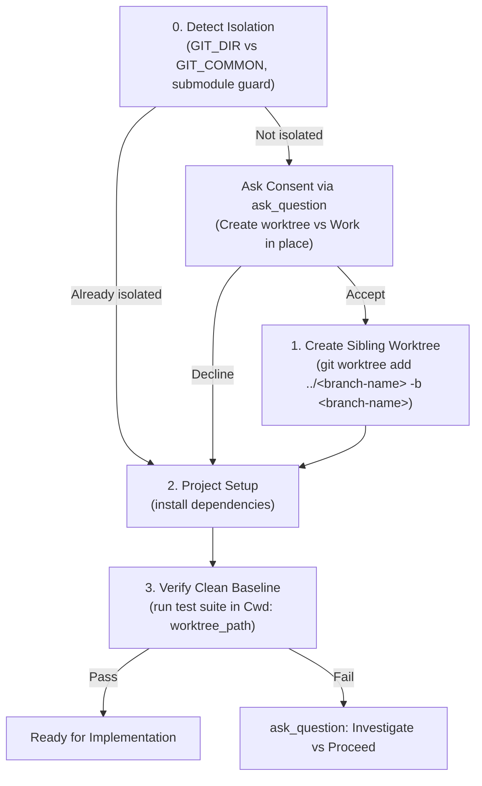

# Design Specification: Antigravity-First Using Git Worktrees Skill

**Date:** 2026-09-28  
**Topic:** Using Git Worktrees Skill Adaptation for Antigravity & Multi-Harness  
**Status:** Approved with Sibling Worktree Directory Architecture  

---

## 1. Context & Motivation

The `using-git-worktrees` skill ensures that development work occurs in an isolated workspace, protecting the active branch and uncommitted modifications from interference.

In the original implementation:
- Nested worktrees inside the repository (e.g., `.worktrees/`) were used, which clutters the primary tree and requires gitignore handling.
- Standalone `cd "$path"` commands were prescribed, directly violating the Antigravity system instruction ("NEVER PROPOSE A cd COMMAND").
- Consent and error recovery were formatted as unstructured text questions rather than interactive terminal dialogs (`ask_question`).
- Native subagent workspace modes (`Workspace: "share"` and `"branch"`) were not documented alongside git worktree mechanics.

This adaptation modernizes `using-git-worktrees` for **Antigravity-First** usage, enforces a clean **sibling directory architecture** under the project root, ensures Antigravity execution safety (using `Cwd` parameter instead of `cd`), introduces interactive modals for decisions, and integrates subagent workspace modes.

---

## 2. Key Architecture Decisions

### 2.1 Sibling Worktree Directory Architecture
Worktrees must **never** be nested inside the default worktree (no `.worktrees/` inside `main/`).
Instead, worktrees must be structured as siblings under the project container directory:

```
my-project/
├── main/               <-- Default worktree
├── feature-auth/       <-- Linked worktree
└── hotfix-login/       <-- Linked worktree
```

* **Path Resolution:**
  When working in a default worktree (e.g., `.../my-project/main`), linked worktrees are created as sibling directories:
  ```bash
  PROJECT_ROOT=$(cd "$(git rev-parse --show-toplevel)/.." && pwd -P)
  WORKTREE_PATH="$PROJECT_ROOT/$BRANCH_NAME"
  git worktree add "$WORKTREE_PATH" -b "$BRANCH_NAME"
  ```
* **Clean Separation:** Eliminates any risk of committing worktree contents into the main repository and avoids `.gitignore` clutter.

### 2.2 Interactive Decision Dialogs (`ask_question`)
* **Worktree Consent**: If not already in an isolated workspace, ask the user:
  - `(Recommended) Create an isolated worktree`
  - `Work in place on current branch`
* **Baseline Test Failures**: If pre-existing tests fail, prompt:
  - `(Recommended) Investigate and fix baseline test failures`
  - `Proceed anyway despite baseline test failures`

### 2.3 Native Subagent Workspaces vs Git Worktrees
* **Subagents**: In Antigravity, subagents can be isolated natively using `invoke_subagent`:
  - `Workspace: "share"` (shares parent repository storage without duplicating disk space, with isolated git branching).
  - `Workspace: "branch"` (clones an isolated workspace branched from parent).
* **Primary Interactive Session**: If manual git worktree creation is selected, create the sibling worktree at `"$PROJECT_ROOT/$BRANCH_NAME"`.

### 2.4 Strict Harness Compliance (No Standalone `cd`)
* Antigravity rules prohibit standalone `cd` commands across tool calls.
* In instructions, specify that agents must never run `cd "$path"`. Instead, set `Cwd: "$path"` on subsequent `run_command` calls, or execute scoped compound commands `(cd "$path" && command)`.

---

## 3. Workflow Specification



---

## 4. Components Modified

| File | Action | Description |
| :--- | :--- | :--- |
| `skills/using-git-worktrees/SKILL.md` | Rewrite | Enforce sibling worktree architecture under project root, replace standalone `cd` with `Cwd`, add Antigravity native subagent workspace documentation, and use `ask_question` for consent and error handling. |

---

## 5. Verification & Acceptance Criteria

1. **Sibling Structure**: Verify that worktree path logic targets `PROJECT_ROOT/$BRANCH_NAME` (sibling of `main/`), not `.worktrees/`.
2. **No Standalone `cd`**: Verify that `cd "$path"` instructions are replaced with `Cwd: "$path"`.
3. **Interactive Modals**: Verify `ask_question` usage for consent and baseline failure decisions.
4. **Subagent Guidance**: Verify clear documentation of Antigravity `Workspace: "share"` and `"branch"`.
5. **Symlink Synchronization**: Verified in `~/.gemini/config/plugins/skills-that-thrill/skills/using-git-worktrees/`.
