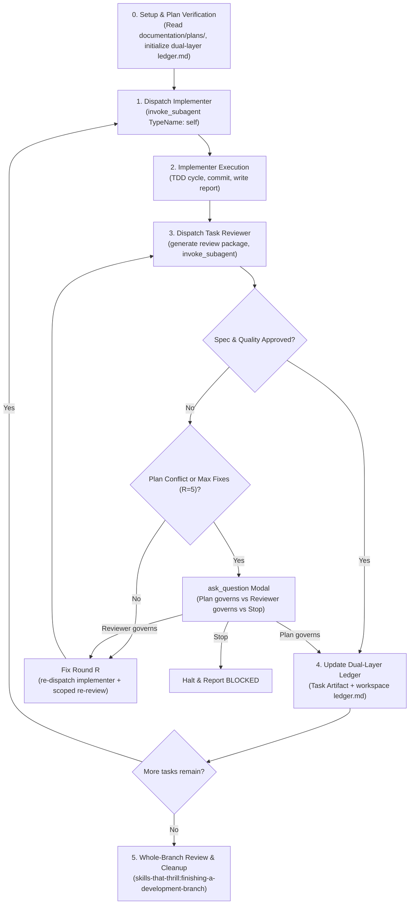

# Design Specification: Antigravity-First Subagent-Driven Development Skill

**Date:** 2026-09-28  
**Topic:** Subagent-Driven Development Skill Adaptation for Antigravity & Multi-Harness  
**Status:** Approved by User (using Markdown `ledger.md`)  

---

## 1. Context & Motivation

The `subagent-driven-development` (SDD) skill coordinates plan execution by dispatching fresh subagents per task, running two-stage reviews (spec compliance and code quality) after each task, and performing a broad final review before integration.

In the original implementation:
- Subagent dispatch examples referenced generic pseudo-blocks and Claude-specific model identifiers (`claude-3-5-sonnet`, `claude-3-5-haiku`).
- Reactive wakeup and messaging primitives (`send_message`, `manage_subagents`) were not documented.
- Task tracking was purely file-based in the repository working tree using `.txt` files, missing Antigravity's visible **Task Artifacts** and rich Markdown IDE rendering.
- Escalation menus and conflict resolution were plain chat prompts rather than interactive dialogs (`ask_question`).
- Plan references used older paths (`documentation/skills-that-thrill/plans/`).

This adaptation modernizes SDD for **Antigravity-First** usage, integrates native `invoke_subagent` execution with reactive wakeup, establishes dual-layer progress tracking with markdown `ledger.md`, standardizes paths on `documentation/plans/`, and uses `ask_question` for interactive adjudications.

---

## 2. Key Architecture Decisions

### 2.1 Native Subagent Dispatch (`invoke_subagent`)
* **Implementer Subagent:**
  - `TypeName: "self"`: Equips the implementer with full write, shell execution, and testing capabilities.
  - `Model`: Default to `"inherit"`. Use `"pro"` for complex architectural tasks or persistent fix rounds (round 4+), and `"flash"` for mechanical changes.
  - `Workspace`: Default to `"inherit"`, or `"share"` / `"branch"` for isolated work.
* **Task Reviewer & Re-Reviewer Subagents:**
  - `TypeName: "research"` (or `"self"` when running git diffs and test suites directly).
  - `Model`: `"inherit"` or `"pro"`.
* **Reactive Wakeup (Zero Polling):**
  - Controllers yield control immediately after dispatching subagents. The system resumes execution automatically upon subagent completion or message arrival. Never run polling loops or sleep scripts.
* **Mid-Task Communication:**
  - Use `send_message(Recipient: conversationId, Message: ...)` if an active implementer asks clarifying questions.

### 2.2 Dual-Layer Markdown Progress Tracking
* **Task Artifact (User-Facing UI):**
  - Save a markdown checklist artifact to `<appDataDir>/brain/<conversation-id>/sdd_progress_<plan_slug>.md` using `write_to_file` with `ArtifactMetadata`.
  - Update status (`- [ ]` -> `- [/]` -> `- [x]`) using `replace_file_content` as tasks start and complete.
* **Workspace Markdown Ledger (`ledger.md`):**
  - Maintain `.skills-that-thrill/sdd/<plan_slug>/ledger.md` containing formatted markdown progress records:
    ```markdown
    # SDD Progress Ledger: <plan_slug>

    | Task | Status | Commit | Review Verdict |
    | :--- | :--- | :--- | :--- |
    | Task 1: Scaffolding | COMPLETE | abc1234 | Approved |
    ```
  - Formatted for clean IDE previewing while easily parsed by scripts and shell commands (`grep`, `awk`).

### 2.3 Interactive Escalation & Adjudication (`ask_question`)
* If a reviewer's findings conflict with the plan text, or if the 5-round fix breaker trips, prompt the human partner using `ask_question`:
  ```
  question: "Task N findings conflict with plan text or hit maximum fix rounds. Which governs?"
  options:
    - "Plan governs: override findings and complete task"
    - "Reviewer governs: require implementer to fix findings"
    - "Escalate / Stop: park findings and halt execution"
  ```

### 2.4 Path & Script Alignment
* Plans must be read from `documentation/plans/YYYY-MM-DD-<feature-name>.md`.
* Corresponding design specs must be referenced from `documentation/specs/YYYY-MM-DD-<topic>-design.md`.
* Update helper scripts and documentation to reflect `documentation/plans/` and `ledger.md`.

---

## 3. Workflow Specification



---

## 4. Components Modified

| File | Action | Description |
| :--- | :--- | :--- |
| `skills/subagent-driven-development/SKILL.md` | Rewrite | Update to Antigravity-First: `invoke_subagent`, reactive wakeup, dual-layer tracking with `ledger.md`, `ask_question` escalations, and `documentation/plans/` paths. |
| `skills/subagent-driven-development/implementer-prompt.md` | Update | Add Antigravity `invoke_subagent` snippet and updated plan/spec paths. |
| `skills/subagent-driven-development/task-reviewer-prompt.md` | Update | Add Antigravity `invoke_subagent` snippet and updated plan/spec paths. |
| `skills/subagent-driven-development/re-review-prompt.md` | Update | Add Antigravity `invoke_subagent` snippet and updated plan/spec paths. |

---

## 5. Verification & Acceptance Criteria

1. **Native Invocations**: Verify all prompt templates include concrete `invoke_subagent` JSON snippets.
2. **Markdown Ledger**: Verify references to `ledger.md` instead of `ledger.txt`.
3. **Path Cleanliness**: All plan references point to `documentation/plans/` and specs to `documentation/specs/`.
4. **Reactive Wakeup**: Clear instructions prohibiting polling loops while waiting for subagents.
5. **Symlink Synchronization**: Verified in `~/.gemini/config/plugins/skills-that-thrill/skills/subagent-driven-development/`.
