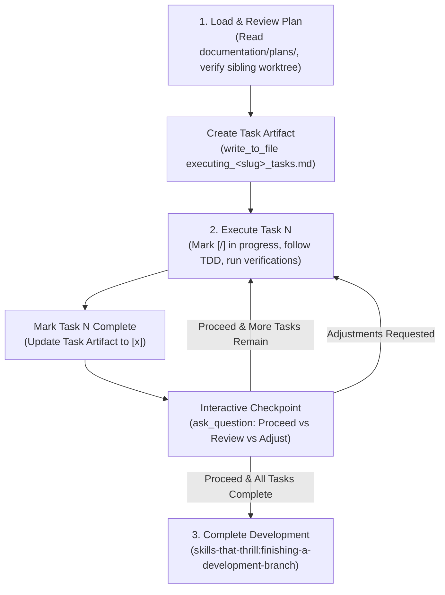

# Design Specification: Antigravity-First Executing Plans Skill

**Date:** 2026-09-28  
**Topic:** Executing Plans Skill Adaptation for Antigravity & Multi-Harness  
**Status:** Approved by User  

---

## 1. Context & Motivation

The `executing-plans` skill guides step-by-step inline execution of an implementation plan directly within a session.

In the original implementation:
- It lacked guidance for Antigravity's **Task Artifacts**, leaving task tracking underspecified.
- Checkpoints and blocker escalations were plain text comments without interactive choice modals.
- Standalone directory transitions were unspecified, risking violations of Antigravity's "never propose a `cd` command" rule.
- Plan references were generic or used deprecated paths.

This adaptation modernizes `executing-plans` for **Antigravity-First** usage, establishing structured **Task Artifact** tracking, interactive `ask_question` review checkpoints after each task, strict `Cwd` execution safety, and standardized `documentation/plans/` paths.

---

## 2. Key Architecture Decisions

### 2.1 Task Tracking via Task Artifacts
* At the start of execution, create a user-facing **Task Artifact** at:
  `<appDataDir>/brain/<conversation-id>/executing_<plan_slug>_tasks.md`
  using `write_to_file` with `ArtifactMetadata` (`UserFacing: true`, `RequestFeedback: false`).
* As tasks progress, update statuses (`- [ ]` -> `- [/]` -> `- [x]`) using sequential `replace_file_content` calls.

### 2.2 Interactive Checkpoints (`ask_question`)
* After completing each task or milestone (and running verification commands), present an interactive review checkpoint via `ask_question`:
  ```
  question: "Task N completed and verified. How would you like to proceed?"
  options:
    - "(Recommended) Proceed to Task N+1"
    - "Review Task N code changes before proceeding"
    - "Request adjustments to Task N"
  ```

### 2.3 Strict Harness Compliance (No Standalone `cd`)
* Standalone `cd` is strictly prohibited in Antigravity.
* For all command executions, specify the `Cwd: "$WORKTREE_PATH"` parameter in `run_command`, or run within a subshell `(cd "$WORKTREE_PATH" && command)`.

### 2.4 Path & Workspace Standards
* Plans are read from `documentation/plans/YYYY-MM-DD-<feature-name>.md`.
* Design specifications are referenced from `documentation/specs/YYYY-MM-DD-<topic>-design.md`.
* Workspace isolation is verified via `skills-that-thrill:using-git-worktrees` (sibling worktree `my-project/<branch>`).

---

## 3. Workflow Specification



---

## 4. Components Modified

| File | Action | Description |
| :--- | :--- | :--- |
| `skills/executing-plans/SKILL.md` | Rewrite | Update to Antigravity-First: Task Artifact tracking, interactive `ask_question` checkpoints, `Cwd` compliance, and `documentation/plans/` paths. |

---

## 5. Verification & Acceptance Criteria

1. **Task Artifact Guidance**: Clear instructions on initializing and updating Task Artifacts.
2. **Interactive Checkpoints**: Explicit `ask_question` checkpoints after each completed task/milestone.
3. **No Standalone `cd`**: Strict enforcement of tool `Cwd` parameter.
4. **Symlink Synchronization**: Verified in `~/.gemini/config/plugins/skills-that-thrill/skills/executing-plans/`.
