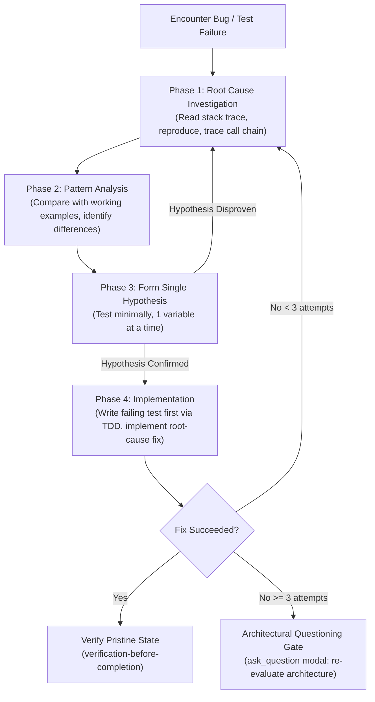

# Design Specification: Antigravity-First Systematic Debugging Skill

**Date:** 2026-09-28  
**Topic:** Systematic Debugging Skill Adaptation for Antigravity & Multi-Harness  
**Status:** Approved by User  

---

## 1. Context & Motivation

The `systematic-debugging` skill enforces disciplined, scientific root-cause investigation whenever bugs, unexpected behaviors, or test failures arise. Proposing fixes without discovering the root cause guarantees recurring bugs, superficial symptom patches, and architectural thrashing.

In the original implementation:
- Shell diagnostic instructions did not account for harness directory isolation rules (risking naked `cd` calls across tool steps).
- Escalations when stuck or when 3+ fixes failed were handled via informal text commentary rather than Antigravity's interactive `ask_question` modals.
- Supporting references mentioned delays without highlighting Antigravity's strict ban on background `sleep` commands.

This adaptation modernizes `systematic-debugging` for **Antigravity-First** usage, enforcing command execution via `Cwd`, establishing interactive `ask_question` escalation gates, prohibiting raw `sleep` commands, and standardizing error reporting.

---

## 2. Key Architecture Decisions

### 2.1 The Iron Law Uncompromised
* **The Iron Law:** `NO FIXES WITHOUT ROOT CAUSE INVESTIGATION FIRST`.
* Proposing fixes without completing Phase 1 investigation is forbidden.

### 2.2 The Four Phases of Systematic Debugging
1. **Phase 1: Root Cause Investigation**:
   - Carefully read entire stack traces and error output (line numbers, codes, paths).
   - Reproduce the bug reliably. If irreproducible, add boundary instrumentation across layers.
   - Trace data flow backward to original source (`root-cause-tracing.md`).
2. **Phase 2: Pattern Analysis**:
   - Locate working examples elsewhere in codebase.
   - Compare against reference implementations completely.
   - Identify every difference.
3. **Phase 3: Hypothesis and Testing**:
   - Formulate a single, specific, falsifiable hypothesis.
   - Test minimally with a single variable changed.
   - If disproven, revert and form a new hypothesis; do not pile changes on top.
4. **Phase 4: Implementation**:
   - Write a minimal failing test first (`skills-that-thrill:test-driven-development`).
   - Implement the focused fix addressing root cause.
   - Verify completely (`skills-that-thrill:verification-before-completion`).

### 2.3 Command Execution Safety (`Cwd` & No Standalone `cd`)
* Antigravity strictly forbids standalone `cd` across tool steps.
* For all diagnostic commands, test reproductions, and script runs, always specify `Cwd: "$WORKTREE_PATH"` in `run_command` (or execute in a subshell `(cd "$WORKTREE_PATH" && ...)`).

### 2.4 Condition-Based Waiting over Sleep
* Background `sleep` commands are prohibited.
* Tests and code must use condition-based polling (`condition-based-waiting.md`) to avoid flakiness and race conditions.

### 2.5 Interactive Escalations (`ask_question`)
* **Irreproducibility Gate**: If an issue cannot be reproduced after logging, pause and ask the human partner for environmental details.
* **Architectural Questioning Gate (3+ Failed Fixes)**: If 3 fixes have failed, do NOT attempt fix #4. Prompt via `ask_question`:
  ```
  question: "3 fix attempts failed, indicating an underlying architectural problem. How should we proceed?"
  options:
    - "(Recommended) Question architecture: examine coupling, state, or pattern fundamentals"
    - "Gather additional boundary traces / diagnostic logs"
    - "Discuss alternative design approach with user"
  ```

---

## 3. Workflow Specification



---

## 4. Components Modified

| File | Action | Description |
| :--- | :--- | :--- |
| `skills/systematic-debugging/SKILL.md` | Rewrite | Update for Antigravity-First: `Cwd` command safety, interactive `ask_question` escalation gates, no sleep rules. |
| `skills/systematic-debugging/condition-based-waiting.md` | Polish | Note Antigravity scheduling rule and clarify condition waiting patterns. |
| `skills/systematic-debugging/defense-in-depth.md` | Polish | Ensure clean formatting and examples. |
| `skills/systematic-debugging/root-cause-tracing.md` | Polish | Ensure clean formatting and backward call tracing examples. |

---

## 5. Verification & Acceptance Criteria

1. **Iron Law Preserved**: Zero tolerance for guessing or symptom patching.
2. **Command Safety**: Strict enforcement of `Cwd` parameter on `run_command`.
3. **Interactive Modals**: Explicit `ask_question` architectural questioning gate.
4. **Symlink Synchronization**: Verified in `~/.gemini/config/plugins/skills-that-thrill/skills/systematic-debugging/`.
