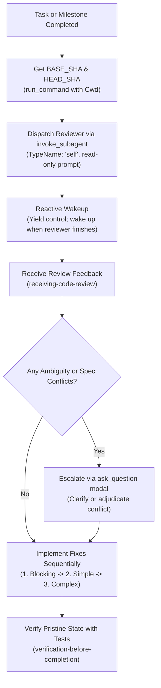

# Design Specification: Antigravity-First Code Review Skills

**Date:** 2026-09-28  
**Topic:** Code Review Skills Adaptation (`requesting-code-review` and `receiving-code-review`)  
**Status:** Approved by User  

---

## 1. Context & Motivation

Code review is a core quality gate in agentic engineering. In subagent-driven and plan execution workflows, code review catches bugs, specification deviations, and architectural regressions before they cascade across subsequent tasks.

The existing code review skills:
- Referenced generic subagent templates without native Antigravity `invoke_subagent` syntax.
- Referenced legacy documentation paths (`documentation/skills-that-thrill/plans/`).
- Did not account for Antigravity directory execution constraints (risking naked `cd` commands for SHA lookups).
- Handled feedback conflicts and pushback informally rather than through structured `ask_question` decision gates.

This adaptation modernizes both `requesting-code-review` and `receiving-code-review` for **Antigravity-First** environments.

---

## 2. Key Architecture Decisions

### 2.1 `requesting-code-review` & `code-reviewer.md`
* **Antigravity Native Subagent Dispatch**:
  - Reviewer dispatched via `invoke_subagent` with `TypeName: "self"` (read-only instruction) or `TypeName: "research"`:
    ```json
    {
      "Subagents": [
        {
          "TypeName": "self",
          "Role": "Code Reviewer",
          "Model": "inherit",
          "Workspace": "inherit",
          "Prompt": "You are a Senior Code Reviewer..."
        }
      ]
    }
    ```
  - `Model: "pro"` is recommended when conducting comprehensive architectural reviews; `Model: "inherit"` is standard for per-task reviews.
* **Reactive Wakeup (Zero Polling)**:
  - The parent coordinator dispatches the reviewer subagent and yields execution. Antigravity automatically wakes the coordinator when the review finishes.
* **Command Execution Safety (`Cwd` & No Standalone `cd`)**:
  - Base and Head SHA resolution (`git rev-parse HEAD~1`, `git rev-parse HEAD`) must use `run_command` with `Cwd: "$WORKTREE_PATH"`.
* **Standardized Documentation Paths**:
  - Link to `documentation/plans/YYYY-MM-DD-HHMM-<feature>.md` and `documentation/specs/YYYY-MM-DD-HHMM-<topic>-design.md`.

### 2.2 `receiving-code-review`
* **Technical Rigor Over Performative Agreement**:
  - The Iron Law of Feedback: Verify before implementing. Ask before assuming.
  - Strict prohibition against performative pleasantries (`"You're absolutely right!"`, `"Thanks for catching that!"`).
* **Structured Feedback Triage**:
  - When review items are ambiguous, do not guess: halt and clarify.
  - Implement in strict order:
    1. Blocking issues (security vulnerabilities, test breakages, regressions).
    2. Simple fixes (imports, formatting, type hints).
    3. Complex fixes (refactorings, structural changes).
  - Test each fix individually.
* **Interactive Conflict Adjudication via `ask_question`**:
  - When external or subagent review suggestions contradict user instructions, architectural plans, or YAGNI principles, do not blindly comply. Trigger an `ask_question` modal:
    - `(Recommended) Reject suggestion with technical justification (violates spec/YAGNI)`
    - `Adopt suggestion and update implementation plan`
    - `Clarify intent with reviewer`
* **GitHub Thread Commenting**:
  - Document replying to inline review threads using either `gh api` (with `Cwd`) or `github-mcp-server` (`add_reply_to_pull_request_comment`).

---

## 3. Workflow Diagrams



---

## 4. Components Modified

| File | Action | Description |
| :--- | :--- | :--- |
| `skills/requesting-code-review/SKILL.md` | Rewrite | Update for Antigravity `invoke_subagent`, reactive wakeup, `Cwd` command safety, and standard paths. |
| `skills/requesting-code-review/code-reviewer.md` | Rewrite | Provide Antigravity `invoke_subagent` JSON block template and explicit read-only instructions. |
| `skills/receiving-code-review/SKILL.md` | Rewrite | Update for Antigravity-First: technical verification rules, `ask_question` conflict escalation, GitHub integration. |

---

## 5. Verification & Acceptance Criteria

1. **Subagent Syntax Validated**: Review templates use valid Antigravity `invoke_subagent` schemas.
2. **Command Safety**: SHA queries enforce `Cwd: "$WORKTREE_PATH"` without standalone `cd`.
3. **Paths Standardized**: References use `documentation/plans/YYYY-MM-DD-HHMM-...`.
4. **Symlink Synchronization**: Verified in `~/.gemini/config/plugins/skills-that-thrill/skills/`.
