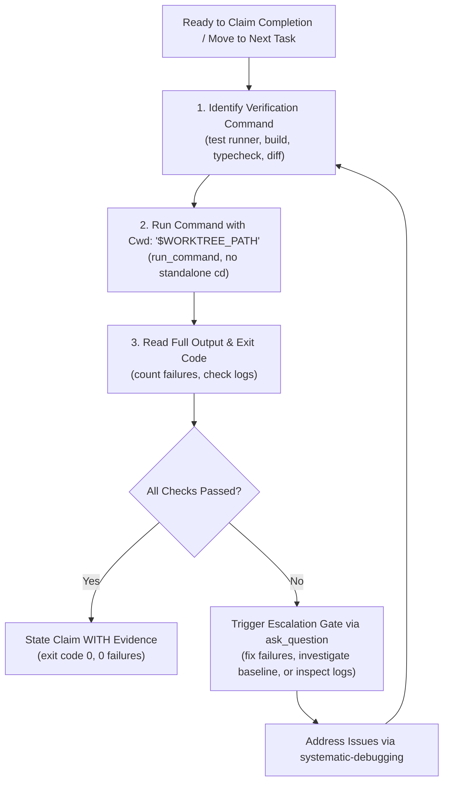

# Design Specification: Antigravity-First Verification Before Completion Skill

**Date:** 2026-09-28  
**Topic:** Verification Before Completion Skill Adaptation for Antigravity & Multi-Harness  
**Status:** Approved by User  

---

## 1. Context & Motivation

The `verification-before-completion` skill is an essential safeguard against premature claims of success, hallucinated passes, unverified refactors, and regressions. Proclaiming completion or expressing satisfaction without fresh, empirical verification evidence undermines confidence and introduces defects into production code.

In the original implementation:
- Verification commands did not specify directory isolation rules (`run_command` with `Cwd`), which in Antigravity can cause tools to execute in the wrong working tree or trigger forbidden standalone `cd` calls.
- Subagent delegation was mentioned generically without Antigravity's specific subagent execution model (`invoke_subagent`).
- Failures encountered during the verification gate were handled via generic rejection rather than an interactive `ask_question` escalation modal.

This adaptation modernizes `verification-before-completion` for **Antigravity-First** usage.

---

## 2. Key Architecture Decisions

### 2.1 The Iron Law Uncompromised
* **The Iron Law:** `NO COMPLETION CLAIMS WITHOUT FRESH VERIFICATION EVIDENCE`.
* Proclaiming that code works, tests pass, bugs are fixed, or tasks are done without having run fresh verification commands in the current interaction is strictly forbidden.

### 2.2 The 5-Step Gate Function
```
BEFORE claiming any status or expressing satisfaction:

1. IDENTIFY: What command proves this claim?
2. RUN: Execute the FULL command (fresh, complete, within proper Cwd)
3. READ: Full output, check exit code, count failures
4. VERIFY: Does output rigorously confirm the claim?
   - If NO: State actual status with evidence
   - If YES: State claim WITH evidence
5. ONLY THEN: Make the claim
```

### 2.3 Command Execution Safety (`Cwd` & No Standalone `cd`)
* All verification commands (tests, linters, type checks, build commands) must be executed with `Cwd: "$WORKTREE_PATH"` via `run_command` (or within compound subshells `(cd "$WORKTREE_PATH" && ...)`).
* Standalone `cd` across tool calls is strictly prohibited.

### 2.4 Independent Subagent Verification
* When subagents report task completion via `invoke_subagent`, the coordinator must not trust the subagent's self-reported "success".
* The coordinator must independently check `git status` / `git diff` and execute fresh verification commands in `Cwd` before marking any task complete or presenting results.

### 2.5 Interactive Escalation Gate (`ask_question`)
* If verification fails when attempting to close out a task, PR, or milestone, do not gloss over the failures.
* Trigger an `ask_question` modal:
  ```
  question: "Verification command failed with <N> errors. How should we proceed?"
  options:
    - "(Recommended) Fix verification failures before claiming completion"
    - "Investigate whether failure is an existing baseline issue"
    - "Inspect detailed failure logs"
  ```

---

## 3. Workflow Specification



---

## 4. Components Modified

| File | Action | Description |
| :--- | :--- | :--- |
| `skills/verification-before-completion/SKILL.md` | Rewrite | Update for Antigravity-First: `Cwd` command safety, independent subagent verification, and interactive `ask_question` escalation gate. |

---

## 5. Verification & Acceptance Criteria

1. **Iron Law Preserved**: Zero tolerance for unverified success claims or confidence statements without fresh evidence.
2. **Command Safety**: Strict enforcement of `Cwd: "$WORKTREE_PATH"` on `run_command`.
3. **Interactive Modals**: Concrete `ask_question` escalation gate upon verification failure.
4. **Symlink Synchronization**: Verified in `~/.gemini/config/plugins/skills-that-thrill/skills/verification-before-completion/`.
