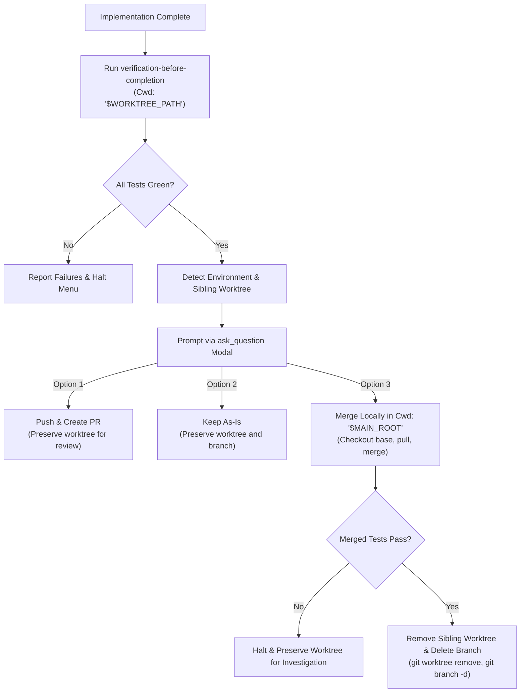

# Design Specification: Antigravity-First Finishing a Development Branch Skill

**Date:** 2026-09-28  
**Topic:** Finishing a Development Branch Skill Adaptation for Antigravity & Sibling Worktrees  
**Status:** Approved by User  

---

## 1. Context & Motivation

When implementation work is finished and verified green, the developer must decide how to integrate the feature branch and handle workspace cleanup.

In the original skill:
- Worktree cleanup assumed worktrees were nested under `.worktrees/` or `worktrees/`, which conflicts with the project's sibling worktree architecture (`my-project/<branch>`).
- Merge and cleanup operations used naked `cd "$MAIN_ROOT"`, which violates Antigravity CLI's execution model and tool rules.
- Integration options were printed as plain text in the chat rather than using an interactive `ask_question` modal.
- `Merge back to <base-branch> locally` was the first option, whereas modern workflows prioritize PRs or keeping branches intact for review.

This adaptation updates `finishing-a-development-branch` to be **Antigravity-First**.

---

## 2. Key Architecture Decisions

### 2.1 Prerequisite Verification Gate
* Before showing any integration menu, run the full verification suite using `skills-that-thrill:verification-before-completion` in `Cwd: "$WORKTREE_PATH"`.
* If tests or checks fail, stop immediately and report the failures. The decision menu only appears when the baseline is verified green.

### 2.2 Sibling Worktree & Environment Detection
* Detect whether the current workspace is a sibling linked worktree:
  ```bash
  GIT_DIR=$(git rev-parse --git-dir)
  GIT_COMMON=$(git rev-parse --git-common-dir)
  WORKTREE_PATH=$(git rev-parse --show-toplevel)
  MAIN_ROOT=$(git -C "$GIT_COMMON/.." rev-parse --show-toplevel)
  ```
* If `GIT_DIR != GIT_COMMON`, this is a linked sibling worktree (`my-project/<branch>`).

### 2.3 Interactive Decision Modal (`ask_question`)
* Present the integration decision using Antigravity's interactive `ask_question` tool.
* Order the options as requested by the user, placing `Merge locally` last:

**For standard / named-branch worktrees:**
```
question: "Implementation complete and verified. What would you like to do with branch <branch-name>?"
options:
  - "Push and create a Pull Request"
  - "Keep the branch as-is (I'll handle it later)"
  - "Merge back to <base-branch> locally"
```

**For detached HEAD worktrees:**
```
question: "Implementation complete and verified on detached HEAD. What would you like to do?"
options:
  - "Push as new branch and create a Pull Request"
  - "Keep as-is (I'll handle it later)"
```

### 2.4 Execution & Cleanup Safety (`Cwd` & No Standalone `cd`)

#### Option 1: Push and Create PR
- Push branch with `run_command` in `Cwd: "$WORKTREE_PATH"`.
- Create PR via `gh pr create` (with `Cwd`) or GitHub MCP server (`create_pull_request`).
- Retain worktree for PR review iteration.

#### Option 2: Keep As-Is
- Retain branch and worktree untouched. Report status to user.

#### Option 3: Merge Locally
- Execute merge operations using `run_command` with `Cwd: "$MAIN_ROOT"` (never standalone `cd`):
  ```bash
  git checkout <base-branch>
  git pull
  git merge <feature-branch>
  ```
- Run fresh verification tests on the merged result in `Cwd: "$MAIN_ROOT"`.
- If tests fail on merged result: stop, leave worktree and branch in place, and investigate.
- Only after merged tests pass: remove the sibling worktree and delete the branch:
  ```bash
  git worktree remove "$WORKTREE_PATH"
  git branch -d <feature-branch>
  ```

---

## 3. Workflow Specification



---

## 4. Components Modified

| File | Action | Description |
| :--- | :--- | :--- |
| `skills/finishing-a-development-branch/SKILL.md` | Rewrite | Update for Antigravity: `ask_question` modal (merge last), sibling worktree cleanup, and `Cwd` command safety. |

---

## 5. Verification & Acceptance Criteria

1. **Option Order Validated**: `Push and create a Pull Request`, `Keep the branch as-is`, then `Merge back to <base-branch> locally`.
2. **Command Safety**: Strict enforcement of `Cwd: "$MAIN_ROOT"` on merge and worktree removal operations.
3. **Sibling Worktree Cleanup**: Replaces outdated `.worktrees/` path check with proper linked worktree detection.
4. **Symlink Synchronization**: Verified in `~/.gemini/config/plugins/skills-that-thrill/skills/finishing-a-development-branch/`.
