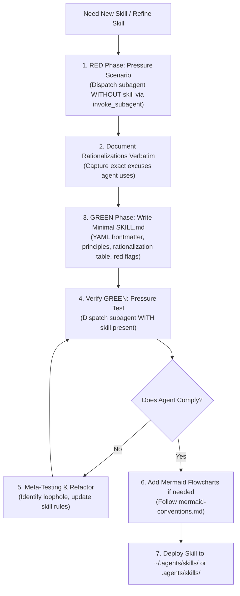

# Design Specification: Antigravity-First Writing Skills Skill

**Date:** 2026-09-28  
**Topic:** Writing Skills Skill Adaptation for Antigravity & Multi-Runtime Environments  
**Status:** Approved by User  

---

## 1. Context & Motivation

The `writing-skills` skill defines how to create, test, and refine skills using Test-Driven Development (TDD applied to process documentation).

In the original skill:
- Skill paths heavily referenced `~/.claude/skills/`.
- Visual diagramming relied on Graphviz (`.dot` files) and external Node.js rendering scripts (`render-graphs.js`), which require auxiliary runtimes and cannot be rendered natively in markdown viewers.
- Testing skills with subagents used generic prompts rather than concrete Antigravity `invoke_subagent` definitions (`TypeName: "self"` / `"research"`).
- Official guidance referenced Claude-specific models (Sonnet, Haiku, Opus).

This adaptation updates `writing-skills` to be **Antigravity-First**, standardizing on cross-runtime paths (`~/.agents/...` preferred), native Mermaid diagrams, and Antigravity subagent testing.

---

## 2. Key Architecture Decisions

### 2.1 Cross-Runtime Skill & Plugin Paths (`~/.agents/...` Preferred)
* Prioritize cross-runtime paths that work across Antigravity, Gemini CLI, Copilot CLI, and Codex:
  - **User Global Scope (`~`):**
    - **Global Skills:** `~/.agents/skills/` (preferred) or `~/.gemini/antigravity-cli/skills/`
    - **Global Plugins:** `~/.agents/plugins/<plugin_name>/skills/` (preferred) or `~/.gemini/config/plugins/<plugin_name>/skills/`
  - **Project-Local Scope (Repository Root):**
    - **Project Skills:** `.agents/skills/`
    - **Project Plugins:** `.agents/plugins/<plugin_name>/skills/`

### 2.2 Standardize on Native Mermaid Visuals (Replace Graphviz)
* Convert Graphviz `.dot` diagrams to native **Mermaid** blocks (`flowchart TD`, `sequenceDiagram`, `stateDiagram-v2`).
* Zero daemon overhead: Mermaid renders directly in IDEs (VSCode, JetBrains) and on GitHub without external SVG generation scripts.
* Add [`mermaid-conventions.md`](file:///home/erichjsonfosse/projects/manjaro-cachy-os-kde-dotfiles/main/config/agents/plugins/skills-that-thrill/skills/writing-skills/mermaid-conventions.md) providing clear style rules (flowchart syntax, quoting node labels with special characters, layout direction).

### 2.3 TDD for Skills with Antigravity Subagents
* Use `invoke_subagent` for skill testing:
  ```json
  {
    "Subagents": [
      {
        "TypeName": "self",
        "Role": "Baseline Tester",
        "Prompt": "Pressure scenario prompt without the skill...",
        "Model": "inherit",
        "Workspace": "inherit"
      }
    ]
  }
  ```
* **RED Phase**: Run pressure scenario without skill, record rationalizations verbatim.
* **GREEN Phase**: Write minimal skill with explicit rationalization counters and red flags.
* **REFACTOR Phase**: Test with skill present, close loopholes until compliance is bulletproof.
* **Reactive Wakeup**: No busy waiting or sleep loops while testing.

### 2.4 Interactive Clarifications (`ask_question`)
* Use `ask_question` when interviewing users or confirming edge cases during skill creation.

---

## 3. Workflow Specification



---

## 4. Components Modified

| File | Action | Description |
| :--- | :--- | :--- |
| `skills/writing-skills/SKILL.md` | Rewrite | Update for Antigravity: `~/.agents/...` paths, Mermaid diagram for flowchart usage, and subagent testing references. |
| `skills/writing-skills/mermaid-conventions.md` | Create | Modern style guide for Mermaid diagrams in skills (replaces graphviz conventions). |
| `skills/writing-skills/testing-skills-with-subagents.md` | Rewrite | Update subagent test instructions to use `invoke_subagent` and Antigravity execution. |

---

## 5. Verification & Acceptance Criteria

1. **Path Alignment**: References `~/.agents/skills/` (preferred) and `.agents/skills/` across all skill documentation.
2. **Mermaid Diagrams**: Native Mermaid syntax in `SKILL.md` and clear Mermaid style guide in `mermaid-conventions.md`.
3. **Subagent Protocol**: Clear mapping to `invoke_subagent` and reactive wakeup.
4. **Symlink Synchronization**: Verified in `~/.gemini/config/plugins/skills-that-thrill/skills/writing-skills/`.
