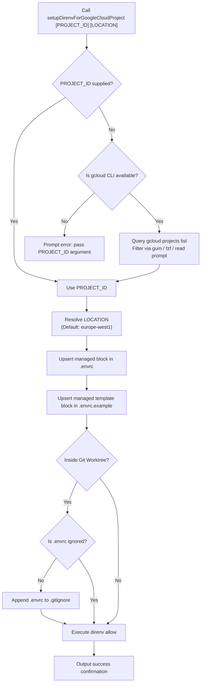

# Design Specification: Google Cloud Direnv Setup Helper Function

**Date:** 2026-09-29  
**Topic:** Globally Available Zsh Function for Direnv Google Cloud Project Setup  
**Status:** Approved by User  
**Files Affected:**
- [`config/zsh/plugins/manjaro-cachy-os-kde-dotfiles/direnv.zsh`](file:///home/erichjsonfosse/projects/manjaro-cachy-os-kde-dotfiles/main/config/zsh/plugins/manjaro-cachy-os-kde-dotfiles/direnv.zsh)
- [`tests/unit/test-direnv-gcp.bats`](file:///home/erichjsonfosse/projects/manjaro-cachy-os-kde-dotfiles/main/tests/unit/test-direnv-gcp.bats)

---

## 1. Context & Motivation

In multi-repository development environments, developer tooling such as Google Antigravity (`agy`), the Google Cloud SDK (`gcloud`), and Vertex AI / Gemini APIs frequently need to operate against distinct Google Cloud projects per repository.

While `direnv` is installed to automatically switch environment variables upon entering a directory, configuring `.envrc` manually across repositories is error-prone, risks committing sensitive environment variables, and requires remembering multiple interrelated GCP variable names.

This specification introduces a globally available shell function—`setupDirenvForGoogleCloudProject`—in the dotfiles Zsh configuration. It automates:
1. Interactive or parameterized selection of the Google Cloud project and region.
2. Idempotent configuration of `.envrc` using managed delimiters.
3. Creation and synchronization of a sanitized `.envrc.example` file suitable for version control.
4. Git safeguard to guarantee `.envrc` is ignored while `.envrc.example` remains tracked.
5. Immediate evaluation and authorization via `direnv allow`.

---

## 2. Architecture & System Boundaries



### 2.1 Function Name & Aliases
* **Primary Function Name:** `setupDirenvForGoogleCloudProject`
* **Convenience Aliases:** `setup-gcp-direnv`, `direnv-gcp`
* **Shell Integration:** Added to [`config/zsh/plugins/manjaro-cachy-os-kde-dotfiles/direnv.zsh`](file:///home/erichjsonfosse/projects/manjaro-cachy-os-kde-dotfiles/main/config/zsh/plugins/manjaro-cachy-os-kde-dotfiles/direnv.zsh), which is automatically loaded in all interactive Zsh shells via Oh My Zsh custom plugin loading.

---

## 3. Data Flow & Interfaces

### 3.1 Input Parameters
* `$1` (`PROJECT_ID`): Optional string. The GCP project ID. If omitted, triggers interactive discovery.
* `$2` (`LOCATION`): Optional string. The Vertex AI / Gemini location. Defaults to `europe-west1` if omitted.

### 3.2 Target Environment Variables
The following environment variables are exported in `.envrc`:

| Variable Name | Purpose | Example Value |
|---|---|---|
| `GOOGLE_CLOUD_PROJECT` | Standard GCP SDK / Vertex AI API project | `my-gcp-project-123` |
| `CLOUDSDK_CORE_PROJECT` | `gcloud` CLI default project | `my-gcp-project-123` |
| `GOOGLE_CLOUD_QUOTA_PROJECT` | Quota & billing tracking for client libraries | `my-gcp-project-123` |
| `GOOGLE_VERTEX_LOCATION` | Vertex AI model invocation region | `europe-west1` |
| `GEMINI_LOCATION` | Gemini Code Assist / CLI region | `europe-west1` |

### 3.3 Managed Block Format in `.envrc`
```bash
# --- BEGIN GCP DIRENV CONFIG ---
export GOOGLE_CLOUD_PROJECT="<PROJECT_ID>"
export CLOUDSDK_CORE_PROJECT="<PROJECT_ID>"
export GOOGLE_CLOUD_QUOTA_PROJECT="<PROJECT_ID>"
export GOOGLE_VERTEX_LOCATION="<LOCATION>"
export GEMINI_LOCATION="<LOCATION>"
# --- END GCP DIRENV CONFIG ---
```

### 3.4 Managed Block Format in `.envrc.example`
```bash
# --- BEGIN GCP DIRENV CONFIG ---
export GOOGLE_CLOUD_PROJECT="your-gcp-project-id"
export CLOUDSDK_CORE_PROJECT="your-gcp-project-id"
export GOOGLE_CLOUD_QUOTA_PROJECT="your-gcp-project-id"
export GOOGLE_VERTEX_LOCATION="europe-west1"
export GEMINI_LOCATION="europe-west1"
# --- END GCP DIRENV CONFIG ---
```

---

## 4. Operational Logic & Idempotency

### 4.1 Block Replacement Algorithm
When updating `.envrc` or `.envrc.example`:
1. If the file does not exist, create it with the block content.
2. If the file exists and contains `# --- BEGIN GCP DIRENV CONFIG ---` and `# --- END GCP DIRENV CONFIG ---`:
   - Replace the lines between and including the delimiters with the updated block.
   - Preserve all lines before `# --- BEGIN GCP DIRENV CONFIG ---` and all lines after `# --- END GCP DIRENV CONFIG ---`.
3. If the file exists without the delimiters:
   - Append a newline (if the file doesn't end with one) followed by the block.

### 4.2 Git Safeguard
1. Verify repository status: `git rev-parse --is-inside-work-tree >/dev/null 2>&1`.
2. Check if `.envrc` is already ignored: `git check-ignore -q .envrc`.
3. If not ignored:
   - Ensure a trailing newline in `.gitignore`.
   - Append `.envrc` to `.gitignore`.
4. Ensure `.envrc.example` is trackable:
   - If a blanket `.envrc*` rule exists in `.gitignore`, ensure `!.envrc.example` is present.

### 4.3 Authorization
1. Verify `direnv` command exists: `command -v direnv >/dev/null 2>&1`.
2. Execute `direnv allow .`.
3. Display clear status output with project name and location.

---

## 5. Edge Cases & Error Handling

1. **Missing `gcloud` when interactive selection requested**:
   - If `$1` is missing and `gcloud` is not installed or not in PATH, output a clear error:
     `"Error: 'gcloud' is not installed or not in PATH. Please specify the project ID: setupDirenvForGoogleCloudProject <project-id> [location]"`
2. **Interactive selection aborted**:
   - If the user cancels the picker (`gum` or `fzf` returns non-zero / empty), abort immediately without touching `.envrc`, `.envrc.example`, or `.gitignore`.
3. **No interactive fuzzy tool available**:
   - If neither `gum` nor `fzf` is available, fall back gracefully to `read -r` prompt with project list hints.
4. **Existing non-standard `.envrc` permissions**:
   - Standard file permissions (`644`) are preserved; `direnv allow` updates direnv's allowlist database without modifying Unix file permissions.

---

## 6. Testing Strategy & Acceptance Criteria

### 6.1 Acceptance Criteria
- [ ] Calling `setupDirenvForGoogleCloudProject test-project` creates `.envrc` with all 5 environment variables set to `test-project` and `europe-west1`.
- [ ] Calling `setupDirenvForGoogleCloudProject test-project us-central1` sets location variables to `us-central1`.
- [ ] Calling `setupDirenvForGoogleCloudProject other-project` when `.envrc` already exists updates the block in-place and preserves pre-existing custom directives.
- [ ] Calling `setupDirenvForGoogleCloudProject` creates or updates `.envrc.example` with non-secret placeholder values.
- [ ] Calling `setupDirenvForGoogleCloudProject` inside a git repo adds `.envrc` to `.gitignore` if not already ignored, but keeps `.envrc.example` eligible for commits.
- [ ] Calling `setupDirenvForGoogleCloudProject` executes `direnv allow`.
- [ ] Aliases `setup-gcp-direnv` and `direnv-gcp` invoke `setupDirenvForGoogleCloudProject`.

### 6.2 Automated Test Suite
- Create unit tests in [`tests/unit/test-direnv-gcp.bats`](file:///home/erichjsonfosse/projects/manjaro-cachy-os-kde-dotfiles/main/tests/unit/test-direnv-gcp.bats) using Bats to execute:
  1. Creation of new `.envrc` and `.envrc.example`.
  2. In-place replacement of existing managed block.
  3. Gitignore appending logic.
  4. Custom location overrides.
