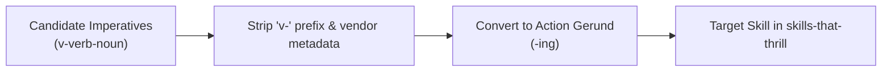

# Design Specification: Skills That Thrill New Skills Adoption & Standardization

**Spec Reference:** [Design Spec](2026-09-29-1250-skills-that-thrill-new-skills-adoption-design.md)  
**Creation Date & Time:** 2026-09-29-1250  
**Source Repository:** [`/home/erichjsonfosse/projects/tests/training-purposes-hauws/main/skills`](file:///home/erichjsonfosse/projects/tests/training-purposes-hauws/main/skills)  
**Target Plugin Directory:** [`config/agents/plugins/skills-that-thrill/skills/`](../../config/agents/plugins/skills-that-thrill/skills/)  

---

## 1. Executive Summary

This design specification outlines the integration of 8 high-value operational and quality skills selected from an enterprise AI engineering skill collection into the user's `skills-that-thrill` plugin suite. It also formalizes naming conventions across the skill set and integrates high-leverage principles into existing skills (`brainstorming` and `requesting-code-review`).

---

## 2. Non-Requirements & Boundary Constraints

To prevent bloat and maintain high signal-to-noise ratio, the following items are **explicitly out of scope**:

- **Vendor-Specific / Internal Skills**: Excluding `v-give-feedback` (Azure webhook endpoint) and `v-guidance` (internal Visma workshops/playbooks).
- **Compliance-Specific Frameworks**: Excluding `v-audit-readiness` (ISAE 3000 Type 2 auditing for financial/ERP applications).
- **Redundant Orchestrators**: Excluding `v-develop-feature`, `v-ship-feature`, and `v-fix-bug` as their capabilities are already handled by our `writing-plans`, `executing-plans`, `subagent-driven-development`, and `finishing-a-development-branch`.
- **Replacing Existing Skills**: Existing skills will remain the primary drivers; candidate skills will complement rather than overwrite existing workflows.

---

## 3. Standardized Naming Convention: Action-Gerund (`-ing`)

All skills in `skills-that-thrill` adhere to active gerund naming (`-ing`), describing the activity the agent performs, with established methodology names retained for compound paradigms.

### Naming Mapping Table

| Source Candidate | Standardized Name | Classification | Target Purpose |
| :--- | :--- | :--- | :--- |
| `v-review-security` | **`reviewing-security`** | Quality / Security | Dedicated security, vulnerability, injection, auth & secrets audit |
| `v-upgrade-dependencies` | **`upgrading-dependencies`** | Maintenance / Ops | Safe, phased dependency updates with release note analysis |
| `v-scored-code-review` | **`adversarial-code-review`** | Quality / Review | Multi-agent review with Finder, Adversary, and Judge |
| `v-manage-ci` | **`managing-ci`** | Infrastructure / CI | GitHub Actions workflow hardening, isolation & troubleshooting |
| `v-test-e2e` | **`testing-e2e`** | Testing | Playwright browser E2E test specs, Page Objects & isolation |
| `v-run-lean` | **`running-lean`** | Cross-cutting Mode | Token frugality, bounded tool outputs & terse communication |
| `v-capture-learning` | **`capturing-learnings`** | Knowledge / Memory | Preserving high-friction workarounds in project memory |
| `v-setup-agent-context` | **`authoring-agent-context`** | Onboarding / Setup | Authoring concise, high-signal AGENTS.md / GEMINI.md files |

---

## 4. Architectural Specifications for New Skills

### 4.1 `reviewing-security`
- **Location:** `skills/reviewing-security/SKILL.md`
- **Core Workflow:**
  1. *Dependency Audit*: Known CVE checks, supply chain risks, unmaintained dependencies.
  2. *Secrets & Credentials Scan*: Scanning git diffs for API keys, tokens, connection strings, leaky logs.
  3. *Input Validation & Injection*: SQL/NoSQL injection, XSS, command injection, path traversal, SSRF.
  4. *Authentication & Access Control*: Protected endpoints, least privilege, RBAC verification, session tokens.
  5. *Data Exposure*: Leaked PII, error stack traces, unmasked IDs.
  6. *Configuration*: CORS policies, CSP headers, TLS enforcement.
- **Output Contract:** Structured report with severity ranking (Critical, High, Medium, Low), attack scenario, remediation, and verification steps.

### 4.2 `upgrading-dependencies`
- **Location:** `skills/upgrading-dependencies/SKILL.md`
- **Core Workflow:**
  1. *Establish Green Baseline*: Ensure test suite passes before touching any dependency.
  2. *Changelog / Release Note Inspection*: Read upstream breaking changes and deprecations *before* updating manifests.
  3. *Topological Bumping*: Upgrade one package at a time in dependency order (foundational packages first).
  4. *Verification Gate Between Steps*: Run tests between each bump to prevent composite debugging headaches.
  5. *Commit Separation*: Separate mechanical version bump commits from subsequent code adaptations.

### 4.3 `adversarial-code-review`
- **Location:** `skills/adversarial-code-review/SKILL.md` and companion prompts/rubrics in `references/` & `agents/`.
- **Core Architecture:**
  - **Finder Subagent**: Discovers potential bugs/vulnerabilities requiring concrete execution paths and broken invariants.
  - **Adversary Subagent**: Incentivized to disprove, downgrade, or narrow issues to eliminate false positives and hallucinated concerns.
  - **Judge Subagent**: Audits disputed issues against source code, awards points, and produces a final ranked scoreboard.
- **Harness Adaptation**: Use Antigravity `invoke_subagent` and native communication; replace any legacy vendor paths.

### 4.4 `managing-ci`
- **Location:** `skills/managing-ci/SKILL.md`
- **Core Workflow:**
  1. *Workflow Organization*: Partition into build, test, quality, and security jobs for clear failure signals.
  2. *Determinism*: Eliminate network flakiness, pin GitHub Actions by full commit SHA, cache safely.
  3. *Security Hardening*: Restrict `GITHUB_TOKEN` permissions to minimal required scopes; isolate fork secrets.

### 4.5 `testing-e2e`
- **Location:** `skills/testing-e2e/SKILL.md` and templates/agents in `templates/` and `agents/`.
- **Core Workflow:**
  1. *Playwright Best Practices*: User-facing locators (`getByRole`, `getByText`), Arrange-Act-Assert structure.
  2. *Page Object Models*: Maintainable encapsulation of reusable UI surfaces.
  3. *State Isolation*: Clean test isolation, session reset, and reproducible test data.

### 4.6 `running-lean`
- **Location:** `skills/running-lean/SKILL.md`
- **Core Workflow:**
  - Active session mode activated on trigger ("go lean", "be brief", "save tokens").
  - *Context-In Frugality*: Bound command outputs (`git status -s`, `head -n 20`), use targeted file slices over full files.
  - *Output-Out Frugality*: Eliminate pleasantries, filler phrases, and boilerplate recap; preserve exact code, paths, and identifiers.

### 4.7 `capturing-learnings`
- **Location:** `skills/capturing-learnings/SKILL.md`
- **Core Workflow:**
  1. *Worthiness Gate*: Only capture non-obvious root causes, tricky library workarounds, or undocumented conventions.
  2. *Trigger Condition*: Formulate clear observable symptoms so the learning resurfaces when the issue recurs.
  3. *Storage*: Save to `docs/ai-memory.md` or `.ai-memory/`, complementing the `/learn` slash command.

### 4.8 `authoring-agent-context`
- **Location:** `skills/authoring-agent-context/SKILL.md`
- **Core Workflow:**
  1. *Audit Friction Points*: Identify what agents actually miss or get wrong in the repo.
  2. *Separation of Inferable vs. Non-Inferable*: Never bloat files with facts agents discover in one tool call.
  3. *Cross-Tool Formats*: Standard `AGENTS.md` at root with tool-specific overrides only when necessary.

---

## 5. Refinements to Existing Skills

### 5.1 `brainstorming/SKILL.md`
- **Improvement**: Add a mandatory **"Non-Requirements & Boundary Constraints"** section in Step 6 (Write Spec Document).
- **Benefit**: Ensures that every design specification produced explicitly states what will *not* be done, stopping scope creep early.

### 5.2 `requesting-code-review/SKILL.md`
- **Improvement**: In the review guidelines and subagent reviewer prompts, mandate a **"Proof-of-Issue"** requirement: findings must state the exact execution path and broken invariant rather than vague warnings.
- **Benefit**: Drastically reduces speculative feedback and false positives during peer review.

---

## 6. Verification and Deployment Plan

1. **Path and Symlink Integrity**:
   - Skills will be authored in `config/agents/plugins/skills-that-thrill/skills/<skill-name>/`.
   - Symlinks at `~/.agents/plugins/skills-that-thrill` and `~/.gemini/config/plugins/skills-that-thrill` automatically reflect changes.
2. **Hygiene & Validation**:
   - Strip all `v-` prefixes in markdown text, YAML frontmatter, file names, and internal cross-references.
   - Clean up any vendor-specific URLs or mentions.
   - Run `git status` to verify clean, structured additions.

---

## 7. Verifiable Acceptance Criteria

- [ ] All 8 new skills are created with valid YAML frontmatter (`name`, `description`).
- [ ] No `v-` prefixes or dead internal links exist in the new skill files.
- [ ] `brainstorming/SKILL.md` is updated with the Non-Requirements requirement.
- [ ] `requesting-code-review/SKILL.md` is updated with the Proof-of-Issue rule.
- [ ] Working tree in `manjaro-cachy-os-kde-dotfiles` is clean and verified with `git status`.
