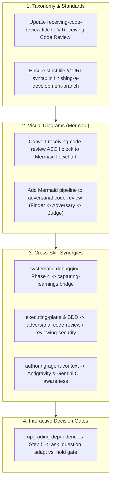

# Design Specification: Skills Refinement, Visual Diagrams & Cross-Skill Synergy

- **Topic:** Final Skills Refinement, Visual Diagrams, and Cross-Skill Synergy
- **Date:** 2026-09-29 13:27
- **Status:** Draft
- **Related Documents:**
  - Upstream Design: [2026-09-29-1250-skills-that-thrill-new-skills-adoption-design.md](2026-09-29-1250-skills-that-thrill-new-skills-adoption-design.md)
  - Upstream Plan: [2026-09-29-1254-new-skills-adoption.md](../plans/2026-09-29-1254-new-skills-adoption.md)

---

## 1. Context & Motivation

Following the successful integration of 8 new skills into `skills-that-thrill`, our full suite now comprises 22 capabilities. A comprehensive audit revealed key refinement opportunities across taxonomy uniformity, IDE diagram visualization, interactive user decision gates, and intelligent cross-skill bridges. 

Implementing these enhancements connects isolated skills into a cohesive, highly synergistic operating system for agentic software engineering.

---

## 2. Non-Requirements & Constraints

- **Non-Requirements:**
  - No removal or renaming of the established 22 skill directory slugs.
  - No introduction of external HTTP rendering servers or binaries for diagram generation.
  - No modification to core execution scripts (`review-package`, etc.).
- **Constraints:**
  - All visual diagrams must use standard GitHub/IDE-compatible Mermaid code blocks (`flowchart TD`, `sequenceDiagram`, etc.) with quoted node labels.
  - Interactive decision points must use `ask_question` with structured, actionable options.
  - Path references must prioritize `~/.agents/...` over `~/.gemini/...`.
  - All file URI markdown links must strictly adhere to `file:///absolute/path` (three slashes).

---

## 3. Architecture & Target Refinements



---

## 4. Detailed Component Changes

### 4.1. Taxonomy & Markdown Compliance
- **[`receiving-code-review/SKILL.md`](../../config/agents/plugins/skills-that-thrill/skills/receiving-code-review/SKILL.md):**
  - Change line 6 `# Code Review Reception` to `# Receiving Code Review`.
- **[`finishing-a-development-branch/SKILL.md`](../../config/agents/plugins/skills-that-thrill/skills/finishing-a-development-branch/SKILL.md):**
  - Line 115: Change `[<path>](file://<path>)` to `[<path>](file:///<path>)`.

### 4.2. Visual Workflow Diagrams
- **[`receiving-code-review/SKILL.md`](../../config/agents/plugins/skills-that-thrill/skills/receiving-code-review/SKILL.md):**
  - Replace the 6-step ASCII block with a clean Mermaid flowchart:
    ```mermaid
    flowchart TD
        A["1. READ<br/>(Complete feedback without reacting)"] --> B["2. UNDERSTAND<br/>(Restate requirement in own words, or ask)"]
        B --> C["3. VERIFY<br/>(Check against codebase reality: grep, test, inspect)"]
        C --> D["4. EVALUATE<br/>(Technically sound for THIS codebase?)"]
        D --> E["5. RESPOND<br/>(Technical acknowledgment or reasoned pushback)"]
        E --> F["6. IMPLEMENT<br/>(One item at a time, test each)"]
    ```
- **[`adversarial-code-review/SKILL.md`](../../config/agents/plugins/skills-that-thrill/skills/adversarial-code-review/SKILL.md):**
  - Insert a visual pipeline diagram under `## Workflow`:
    ```mermaid
    flowchart TD
        A["1. Define Review Target<br/>(PR, branch diff, files)"] --> B["2. Scope & Dispatch Finders<br/>(1 or more Points Review Finder subagents)"]
        B --> C["3. Merge Duplicate Issues<br/>(Keep strongest proof & highest severity)"]
        C --> D["4. Adversary Challenge<br/>(Points Review Adversary subagent challenges claims)"]
        D --> E["5. Final Adjudication<br/>(Points Review Judge subagent settles score)"]
        E --> F["6. Persist & Present<br/>(Save to .reviews/ and output final scoreboard)"]
    ```

### 4.3. Cross-Skill Synergies & Handoffs
- **[`systematic-debugging/SKILL.md`](../../config/agents/plugins/skills-that-thrill/skills/systematic-debugging/SKILL.md):**
  - In Phase 4, Step 3 (Verify Fix): Add guidance to invoke `skills-that-thrill:capturing-learnings` (or recommend `/learn` in Antigravity) whenever the resolved root cause was non-obvious, surprising, or incurred high investigation friction.
- **[`subagent-driven-development/SKILL.md`](../../config/agents/plugins/skills-that-thrill/skills/subagent-driven-development/SKILL.md) & [`executing-plans/SKILL.md`](../../config/agents/plugins/skills-that-thrill/skills/executing-plans/SKILL.md):**
  - In the Final Review section: Recommend invoking `skills-that-thrill:adversarial-code-review` and `skills-that-thrill:reviewing-security` when completing high-stakes, security-sensitive, or architecturally complex features.
- **[`authoring-agent-context/SKILL.md`](../../config/agents/plugins/skills-that-thrill/skills/authoring-agent-context/SKILL.md):**
  - In Section 1 ("Identify the target tools"), explicitly add:
    - `Antigravity CLI / IDE reads AGENTS.md (project root and ~/.agents/ or ~/.gemini/antigravity-cli/)`
    - `Gemini CLI reads GEMINI.md (project root and ~/.gemini/GEMINI.md, falling back to AGENTS.md)`

### 4.4. Interactive Decision Gates (`ask_question`)
- **[`upgrading-dependencies/SKILL.md`](../../config/agents/plugins/skills-that-thrill/skills/upgrading-dependencies/SKILL.md):**
  - In Step 5 ("Decide: adapt or hold"): Add structured `ask_question` guidance when breaking migrations or high adaptation costs occur:
    - `(Recommended) Adapt code to new API in separate commit`
    - `Hold dependency at current version and document reason`
    - `Isolate and defer upgrade`

---

## 5. Verification Strategy

1. **Lint & Rendering Integrity:** Check that all Mermaid blocks render valid diagram syntax.
2. **Link Validation:** Run Python link check script to verify all local and relative markdown links are valid.
3. **Fidelity Scan:** Verify all title, cross-skill, and interactive prompts are cleanly positioned.
