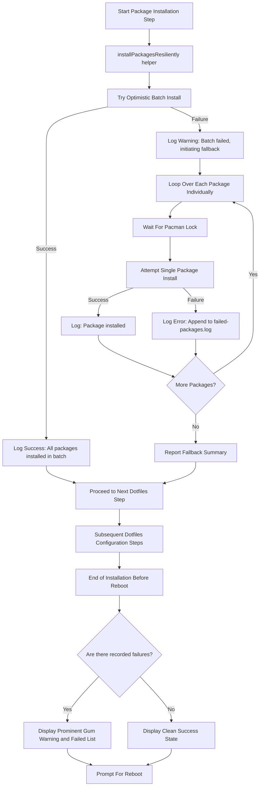

# Design Specification: Resilient Package Installation & Failure Logging

- **Topic:** Resilient Package Installation with Batching, Fallback, and Failure Logging
- **Date:** 2026-09-29
- **Status:** DRAFT (Awaiting Approval)
- **Target Files:**
  - [`utilities/during-install/utilities.sh`](../../utilities/during-install/utilities.sh)
  - [`install/pacman-packages.sh`](../../install/pacman-packages.sh)
  - [`install/aur-packages.sh`](../../install/aur-packages.sh)
  - [`set-variables.sh`](../../set-variables.sh)
  - [`init.sh`](../../init.sh)
  - [`.gitignore`](../../.gitignore)

---

## 1. Problem Statement & Motivation

During dotfiles installation, `init.sh` executes package installation in Step 4 (`installPacmanPackages`) and Step 5 (`installAurPackages`) under `bash -c "set -eo pipefail; ..."`.

When a single package in the target array is missing, renamed, deleted from the AUR (e.g. `slack-desktop-wayland`), or encounters a build conflict:
1. `pacman` or `paru` aborts the entire transaction.
2. Because of `set -e`, the installation script exits immediately with code 1.
3. All subsequent steps (Zsh configuration, Git setup, Docker, Pyenv, SSH agent, KWin rules, AI agent skills, etc.) are never executed.
4. The user is left with a half-installed system and no record of which package failed or what needs remediation.

---

## 2. Requirements & Goals

### Functional Requirements
1. **Optimistic Fast Path:** When all packages are valid (standard case), install them in a single batch transaction via `pacman` or `paru` for maximum speed.
2. **Resilient Fallback:** If the batch installation command returns a non-zero exit code:
   - Catch the failure without terminating `init.sh`.
   - Log a descriptive warning.
   - Iterate through the package list individually, attempting to install each package.
   - Packages that succeed are installed; packages that fail are caught and recorded.
3. **Structured Failure Logging:**
   - Record every failed package with its package manager tag (`[pacman]` or `[aur]`) and timestamp to `$BASEDIR/failed-packages.log`.
   - File is formatted cleanly so it directly informs package list maintenance.
4. **End-of-Run Summary:**
   - In `init.sh`, prior to prompting for reboot, check if `failed-packages.log` exists and contains failures.
   - Render a high-visibility summary using `gum style` / `gum format` highlighting the failed packages and pointing to the log.
5. **Git Hygiene:** Add `failed-packages.log` to `.gitignore`.

### Non-Goals
- Automatic package substitution (we do not guess alternate package names at runtime).
- Retrying infinitely or bypassing pacman lock safety.

---

## 3. Architecture & Flow



---

## 4. Detailed Component Design

### 4.1 Environment Variables ([`set-variables.sh`](../../set-variables.sh))
Add the canonical path to the log file:
```bash
FAILED_PACKAGES_LOG="$BASEDIR/failed-packages.log"
export FAILED_PACKAGES_LOG
```

### 4.2 Helper Function ([`utilities/during-install/utilities.sh`](../../utilities/during-install/utilities.sh))
Implement `installPackagesResiliently`:
```bash
installPackagesResiliently()
{
  local tool="$1" # "pacman" or "paru"
  shift
  local -a pkgs=("$@")
  local -a failed_pkgs=()

  if [ ${#pkgs[@]} -eq 0 ]; then
    return 0
  fi

  waitForPacmanLock

  # 1. Optimistic batch install
  local batch_cmd=()
  if [ "$tool" = "pacman" ]; then
    batch_cmd=(sudo pacman -S --needed --noconfirm "${pkgs[@]}")
  elif [ "$tool" = "paru" ]; then
    batch_cmd=(paru -Syu --needed --noconfirm "${pkgs[@]}")
  fi

  logInfo "Attempting batch installation of ${#pkgs[@]} $tool package(s)..."
  if "${batch_cmd[@]}"; then
    logSuccess "All $tool packages installed successfully in batch"
    return 0
  fi

  # 2. Resilient fallback: iterate individually
  logWarning "Batch installation failed. Retrying packages individually to isolate failures..."
  for pkg in "${pkgs[@]}"; do
    waitForPacmanLock
    logInfo "Installing $pkg ($tool)..."

    local single_cmd=()
    if [ "$tool" = "pacman" ]; then
      single_cmd=(sudo pacman -S --needed --noconfirm "$pkg")
    elif [ "$tool" = "paru" ]; then
      single_cmd=(paru -S --needed --noconfirm "$pkg")
    fi

    if ! "${single_cmd[@]}"; then
      logError "Failed to install $tool package: $pkg"
      failed_pkgs+=("$pkg")
      
      # Append to failure log
      mkdir -p "$(dirname "$FAILED_PACKAGES_LOG")"
      if [ ! -f "$FAILED_PACKAGES_LOG" ]; then
        echo "# Dotfiles Failed Packages Log" > "$FAILED_PACKAGES_LOG"
        echo "# Recorded on $(date '+%Y-%m-%d %H:%M:%S')" >> "$FAILED_PACKAGES_LOG"
        echo "# Format: [<manager>] <package_name>" >> "$FAILED_PACKAGES_LOG"
        echo "" >> "$FAILED_PACKAGES_LOG"
      fi
      echo "[$tool] $pkg" >> "$FAILED_PACKAGES_LOG"
    else
      logSuccess "Successfully installed $pkg ($tool)"
    fi
  done

  if [ ${#failed_pkgs[@]} -gt 0 ]; then
    logWarning "${#failed_pkgs[@]} $tool package(s) failed: ${failed_pkgs[*]}"
    logWarning "Details appended to $FAILED_PACKAGES_LOG"
  else
    logSuccess "All $tool packages installed after individual retry"
  fi

  return 0
}
```

### 4.3 Installer Integration
- **[`install/pacman-packages.sh`](../../install/pacman-packages.sh):**
  Replace raw `sudo pacman -S --needed --noconfirm "${packages[@]}"` with:
  ```bash
  logHeader "Installing pacman packages"
  installPackagesResiliently "pacman" "${packages[@]}"
  ```
- **[`install/aur-packages.sh`](../../install/aur-packages.sh):**
  Replace raw `paru -Syu --needed --noconfirm "${packages[@]}"` with:
  ```bash
  logHeader "Installing AUR packages"
  installPackagesResiliently "paru" "${packages[@]}"
  ```

### 4.4 End-of-Run Summary ([`init.sh`](../../init.sh))
In `init.sh` right before `promptForReboot`:
```bash
displayFailedPackagesSummary()
{
  if [ -f "$FAILED_PACKAGES_LOG" ] && [ -s "$FAILED_PACKAGES_LOG" ]; then
    echo ""
    logHeader "Package Installation Notice"
    gum style --foreground 214 --bold "⚠️  Some packages could not be installed during setup."
    gum style --foreground 245 "A record of failed packages was saved to: $FAILED_PACKAGES_LOG"
    echo ""
    gum style --foreground 196 --bold "Failed Packages:"
    while IFS= read -r line; do
      [[ "$line" =~ ^#.*$ || -z "$line" ]] && continue
      echo "  • $line"
    done < "$FAILED_PACKAGES_LOG"
    echo ""
    gum style --foreground 245 "Use this list as a reference to clean or update your package lists in:"
    gum style --foreground 245 "  - install/pacman-packages.sh"
    gum style --foreground 245 "  - install/aur-packages.sh"
    echo ""
  fi
}
```

---

## 5. Verification Plan

1. **Unit / Dry-run Test**:
   - Create a test script with intentional dummy/invalid package names (e.g. `nonexistent-pacman-dummy-pkg-xyz`).
   - Run `installPackagesResiliently` in a controlled subshell.
   - Verify batch failure detection.
   - Verify fallback execution and log generation in `failed-packages.log`.
   - Verify script returns exit code 0 (does not break `set -e`).
2. **Live Shellcheck & Syntax**:
   - Run `shellcheck` across `utilities.sh`, `pacman-packages.sh`, `aur-packages.sh`, and `init.sh`.
