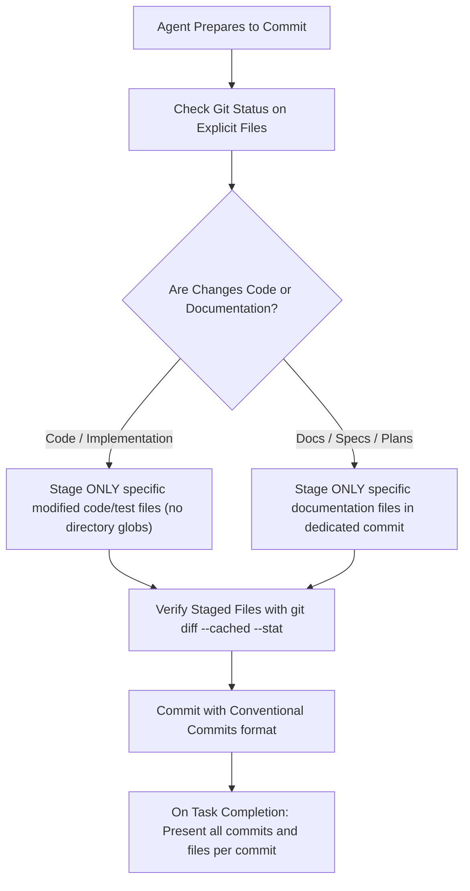

# Design Specification: Git Conventions Rule for AI Coding Agents

- **Topic:** Enforcing Strict Explicit Git Staging, Documentation Isolation, and Conventional Commits
- **Date:** 2026-09-29
- **Status:** APPROVED
- **Target Files:**
  - [`config/agents/plugins/skills-that-thrill/rules/git-conventions.md`](../../config/agents/plugins/skills-that-thrill/rules/git-conventions.md)
  - [`config/agents/plugins/skills-that-thrill/rules/AGENTS.md`](../../config/agents/plugins/skills-that-thrill/rules/AGENTS.md)
  - [`config/agents/plugins/skills-that-thrill/rules/GEMINI.md`](../../config/agents/plugins/skills-that-thrill/rules/GEMINI.md)

---

## 1. Problem Statement & Motivation

During autonomous execution, coding agents often stage files broadly (e.g. `git add .`, `git add -A`, or globbing directories like `git add documentation/`).

In this repository, that practice recently resulted in staging and committing 30+ previously untracked design specs and implementation plans alongside runtime installer changes.

To maintain a clean git history and prevent unintended commits:
1. Staging must be strictly atomic and explicit to only the files touched in the current task.
2. Design specs and implementation plans must be committed in dedicated documentation commits, never mixed with functional runtime code.
3. Commit messages must follow structured Conventional Commits syntax.
4. Destructive git actions (force pushing, blind hard resets) must be strictly forbidden.

---

## 2. Rule Architecture & Directives

The rule file will be placed at `config/agents/plugins/skills-that-thrill/rules/git-conventions.md` and included in both `AGENTS.md` and `GEMINI.md`.

---

## 3. Directives & Specification Content

The rule content in `rules/git-conventions.md` will define:

### 3.1 Strict Explicit Staging
- **FORBIDDEN:** `git add .`, `git add -A`, `git add *`, `git add <dir>/` (without individual file targets).
- **MANDATORY:** Always specify exact file paths: `git add path/to/file1.sh path/to/file2.sh`.
- **PRE-STAGING CHECK:** Check `git status -s <files>` before staging.
- **POST-STAGING CHECK:** Check `git diff --cached --stat` to verify only intended files are in the index.

### 3.2 Documentation & Specification Isolation
- Plans (`documentation/plans/*`) and specs (`documentation/specs/*`) must NEVER be bundled into code or bugfix commits.
- When committing plans or specs, create dedicated commits prefixed with `docs(spec):` or `docs(plan):`.
- Never stage untracked files from unrelated tasks or previous sessions.

### 3.3 Conventional Commits Standard
- Format: `<type>(<scope>): <short imperative summary>`
- Allowed types:
  - `feat`: New feature or user-facing capability
  - `fix`: Bug fix
  - `docs`: Documentation, design specs, implementation plans
  - `test`: Adding or modifying tests
  - `refactor`: Internal code refactoring without behavior change
  - `chore`: Tooling, version bumps, dependencies, housekeeping
- Rules: Imperative mood, lowercase, no trailing period, concise scope.

### 3.4 Small & Cherry-Pickable Commits
- Commits must be small, atomic, and focused on a single logical change.
- Each commit should be self-contained and clean enough to be cherry-picked onto another branch without pulling in unrelated or incomplete changes.
- Never bundle multiple unrelated refactorings, features, or fixes into one commit.

### 3.5 Task Completion Presentation
- On task completion (and at execution checkpoints), the agent must explicitly summarize:
  - Every commit created during the task/step (short hash and full commit message).
  - The exact list of files modified per commit (using clickable markdown file links).

### 3.6 Safety Invariants
- Never use `--no-verify` to bypass pre-commit hooks unless explicitly instructed by the user.
- Never force push (`git push -f`) to `main`, `master`, or tracking branches.
- Never execute destructive cleanup (`git reset --hard`, `git clean -fd`) without explicit user permission.

---

## 4. Size & Token Budget Audit

- Current expanded `AGENTS.md`: ~14.7 KB.
- Estimated size of `git-conventions.md`: ~1.5 KB.
- Total expanded `AGENTS.md`: ~16.2 KB (comfortably below the 24 KB ceiling).
