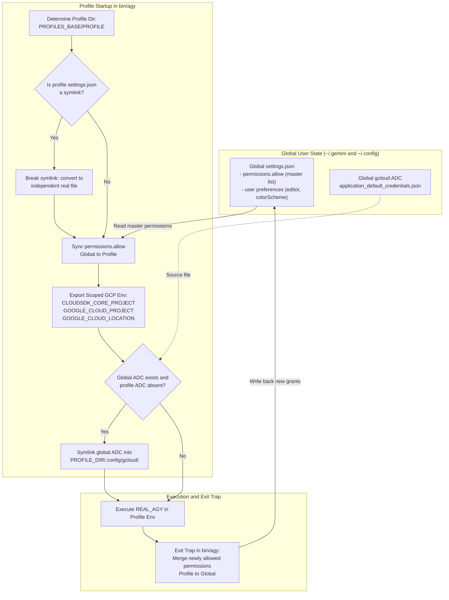

# Design Specification: Agy Selective Permission Sync & Google Cloud Project Isolation

**Date:** 2026-10-06  
**Topic:** Selective Permission Sync and Concurrent Google Cloud Project Isolation across Antigravity Profiles  
**Status:** Approved by User  
**Files Affected:**
- [`bin/agy`](../../bin/agy)
- [`tests/test-agy-selective-permissions.sh`](../../tests/test-agy-selective-permissions.sh)

---

## 1. Context & Motivation

Antigravity CLI (`agy`) profiles provide sandbox isolation per Git repository and workspace by running under an isolated profile directory (`$PROFILE_DIR`), re-pointing `$HOME`, `$XDG_CONFIG_HOME`, `$XDG_DATA_HOME`, `$XDG_STATE_HOME`, and `$XDG_CACHE_HOME`.

In previous iterations, two competing friction points emerged:
1. **Permission Prompt Fatigue**: Users running `agy` across multiple repositories frequently had to grant permission for standard commands (`git`, `ls`, `grep`, `cat`, etc.) in each repository profile.
2. **Global Setting Collision**: A whole-file symlink of `settings.json` between the global user home and the profile directory allowed sharing permissions, but broke Google Cloud project isolation. Because `settings.json` also stores `"gcp": { "project": "...", "location": "..." }`, any profile updating or setting its GCP project overwrote the configuration for all other profiles.

Furthermore, session and authentication state for Google Cloud spans both:
- Built-in `agy` Google OAuth tokens stored in the Linux system keyring (D-Bus Secret Service / KWallet), keyed to the user identity.
- Application Default Credentials (ADC) stored in `$XDG_CONFIG_HOME/gcloud/application_default_credentials.json`.

This specification formalizes the architecture to achieve:
1. **True concurrent multi-project isolation**: Each profile maintains its own project settings without cross-contamination.
2. **Seamless, fatigue-free permissions**: Shared allowed commands synchronize bidirectionally between the global settings and active profiles.
3. **Session re-use**: Shared authentication credentials allow logging in once while keeping project context strictly isolated.

---

## 2. Architecture & System Boundaries

---

## 3. Detailed Component Requirements

### 3.1 Profile `settings.json` Independence
- `$PROFILE_DIR/.gemini/antigravity-cli/settings.json` MUST be a standalone regular JSON file, **NEVER** a symbolic link to the global `settings.json`.
- If an existing profile has a symlink pointing to `$ORIG_HOME/.gemini/antigravity-cli/settings.json`, `bin/agy` will break the symlink and replace it with an independent file preserving any valid JSON data.
- If no profile `settings.json` exists, `bin/agy` initializes one with the workspace's default configuration and global non-conflicting preferences (`colorScheme`, `editor`, `notifications`), but without inheriting the global `gcp.project` or global `trustedWorkspaces`.

### 3.2 Bidirectional Selective Permission Synchronization
- **Startup Sync (Global -> Profile)**:
  `bin/agy` reads `permissions.allow`, `permissions.deny`, and `permissions.ask` arrays from `$ORIG_HOME/.gemini/antigravity-cli/settings.json` and unions them into the profile's `settings.json`.
  Existing profile-specific settings (such as `"gcp"` and `"trustedWorkspaces"`) are preserved untouched.
- **Exit Sync (Profile -> Global)**:
  Upon exit (via the bash `EXIT` trap), `bin/agy` inspects the profile's `settings.json`. Any permissions added during the interactive session (e.g., when the user selects "Always allow") are merged back into `$ORIG_HOME/.gemini/antigravity-cli/settings.json` without modifying the global `.gcp` or `.trustedWorkspaces` blocks.

### 3.3 Google Cloud Project Scoping & Environment Exports
- If `$PROFILE_DIR/.gemini/antigravity-cli/settings.json` specifies `.gcp.project`:
  - Export `CLOUDSDK_CORE_PROJECT="$gcp_project"`
  - Export `GOOGLE_CLOUD_PROJECT="$gcp_project"`
  - Export `GOOGLE_CLOUD_QUOTA_PROJECT="$gcp_project"`
- If `.gcp.location` is specified:
  - Export `GOOGLE_CLOUD_LOCATION="$gcp_location"`
  - Export `GOOGLE_VERTEX_LOCATION="$gcp_location"`
  - Export `GEMINI_LOCATION="$gcp_location"`
- These environment variables ensure that `agy`, child shells, `gcloud`, and Google SDKs seamlessly target the profile's designated GCP project without cross-project collisions.

### 3.4 Application Default Credentials (ADC) Symlink
- If `$ORIG_HOME/.config/gcloud/application_default_credentials.json` exists and `$PROFILE_DIR/.config/gcloud/application_default_credentials.json` does not exist:
  - Create `$PROFILE_DIR/.config/gcloud`
  - Symlink `$ORIG_HOME/.config/gcloud/application_default_credentials.json` -> `$PROFILE_DIR/.config/gcloud/application_default_credentials.json`
- Other `gcloud` state files (e.g., `configurations/`, `active_config`, `logs/`) remain profile-local to prevent active configuration conflicts.

---

## 4. Verification & Testing Strategy

1. **Unit / Integration Tests ([`tests/test-agy-selective-permissions.sh`](../../tests/test-agy-selective-permissions.sh))**:
   - Test symlink breaking and real file conversion.
   - Test permission unioning from global to profile without clobbering `gcp.project`.
   - Test permission unioning from profile back to global on exit without overwriting global `gcp.project`.
   - Test independent projects for Profile A (`firmakonto`) and Profile B (`dotfiles-gcp`) simultaneously.
   - Test ADC symlink creation when global credentials exist.
2. **Static Analysis**:
   - `shellcheck bin/agy tests/test-agy-selective-permissions.sh`
3. **Repository State Inspection**:
   - Verify that existing profiles (`firmakonto-api`, `manjaro-cachy-os-kde-dotfiles`) remain intact and function as expected.
